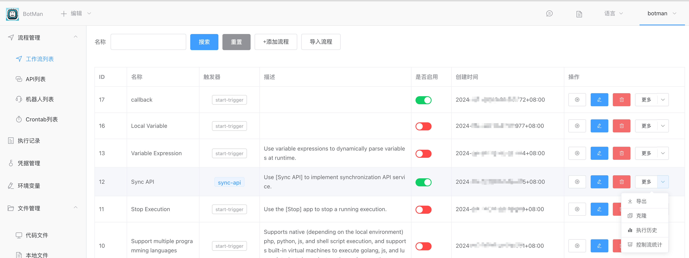
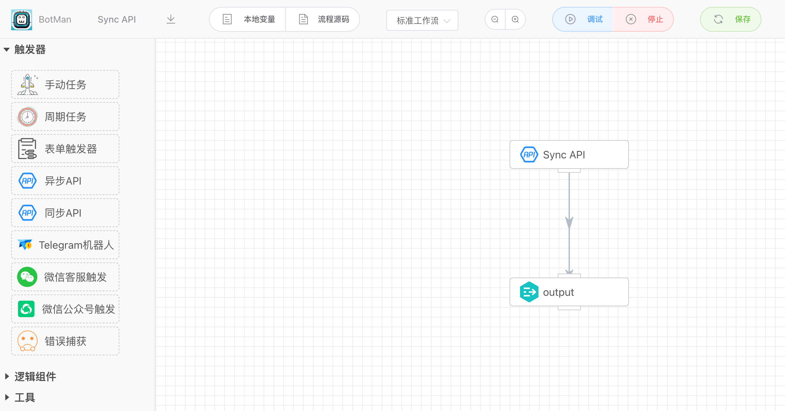
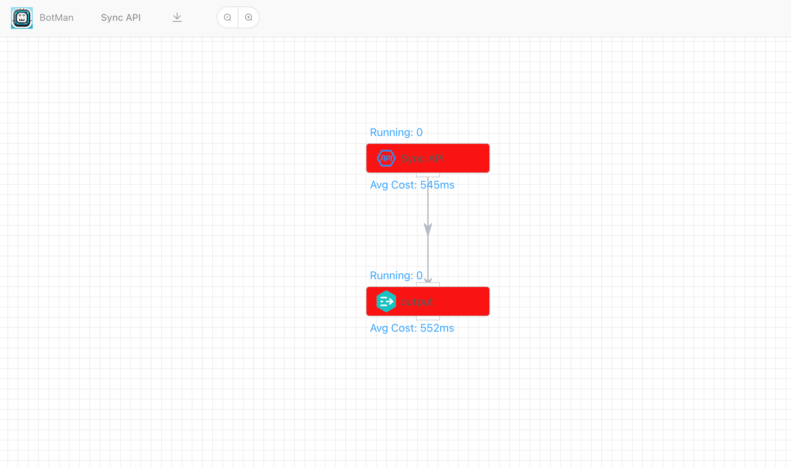

在【流程管理】菜单下【工作流列表】，点击操作一栏的更多按钮，会显示一个【控制流统计】的菜单项，点击该选项可以跳转到具体的流程分析页面。

下图是原工作流的流程定义：

点击【控制流统计】，跳转到如下的界面。图中的数据是历史所有的执行记录数据，可以看到流程中每个节点的执行耗时，以及运行中的任务数量。执行越耗时，显示的红色会越深。这样可以方便管理人员直观地了解到流程的瓶颈所在，快速定位到问题。

