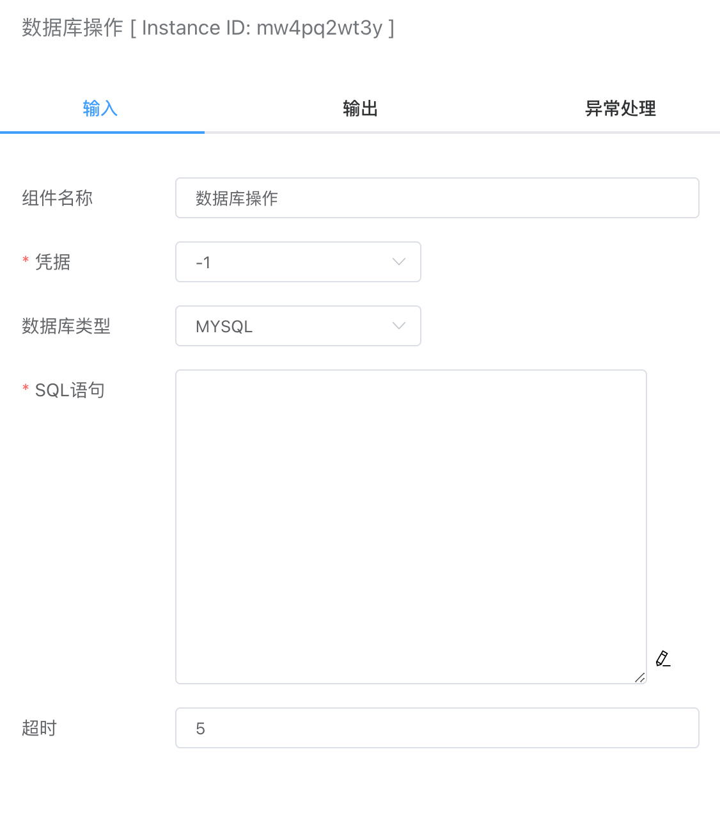

## 数据库操作

支持输入SQL语句实现对数据库的增删改查等操作。


## 入参



### 凭据

可在【凭据管理】里创建数据库凭据类型。需要配置如下几个选项：

- 主机。远程主机地址。
- 端口。数据库端口，默认3306。
- 用户：数据库账号。
- 密码：数据库密码。
- 编码：数据库读写编码格式，默认utf8。


### 数据库类型

目前支持如下数据库：

- MySQL
- Postgres
- SQL Server


### SQL语句

支持基础的增删改查命令，即select、update、delete、insert语句。


## 出参

- 如果是select操作，返回的是一个JSON数组，例如：

  ```json
  [{"id":1, "name":"test1"}]
  ```

- 如果是insert操作，返回自增长id和受影响的数量：

  ```json
  {
      "LastInsertId": 16,
      "RowAffected": 1
  }
  ```

- 如果是delete和update操作，返回受影响的数量：

  ```json
  {
      "RowAffected": 1
  }
  ```


