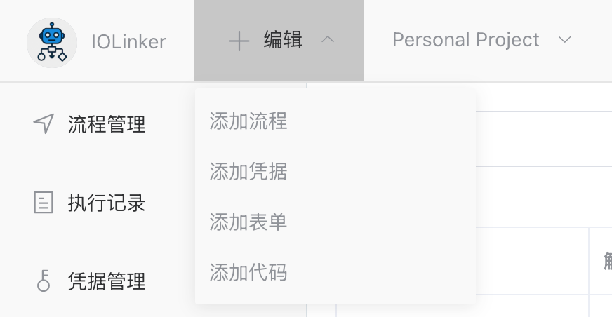
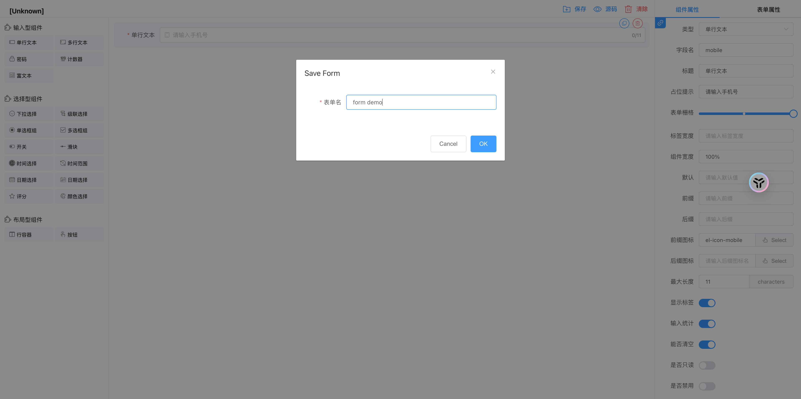

## 表单任务

在工作流系统中，基于表单引擎设计表单，关联工作流后生成一个唯一的表单提交地址，用户通过填写并提交表单，触发工作流的流转和继续执行。


### 操作步骤

#### 1. 创建表单



#### 2. 设计并保存表单



保存后的表单，可以在左侧的【表单】菜单选项查看到：


#### 3. 创建工作流并关联表单

使用【表单任务】并在表单下拉列表中选择前面创建好的表单，表示该节点表单任务是用选择的表单。


我们在【表单】菜单下也可以通过表单查看关联的工作流：


#### 4. 启动工作流并创建表单任务实例

在【工作流】可以看到前面创建的工作流，点击操作列的第一个启动按钮，工作流执行到表单任务节点后，会创建一个或多个表单任务实例。


在【用户任务】的【表单】菜单下可以看到创建的表单任务实例，每个表单成员都会创建一个唯一的表单任务实例（对应唯一的表单提交地址），用于提交表单任务。


####  5.提交表单

点击表单菜单下的待处理表单提交地址，进入表单提交页面，输入数据后点击提交即可。引擎会根据或签或会签类型结合实际提交的情况判断是否可以运行下一个节点。


#### 6. 查看表单提交记录

表单提交记录(工作流执行记录)：


点击查看详情，可以看到表单提交的数据：


## 入参

### 表单

这里可以下拉选择要关联的表单。

### 成员

设置允许填写表单的成员。

### 类型

- 或签：只要有一个成员审批同意即通过，进入下一个节点
- 会签：需要所有成员审批通过，才进入下一个节点


## 出参

如下，输出会显示提交人在什么时候提交的数据，以及表单各个选项的值(submitData下)。

```
[
  {
    "CreateAt": "2025-05-13 09:45:50",
    "Members": "iolinker",
    "Name": "表单任务",
    "SubmitList": [
      {
        "opId": 44,
        "status": 1,
        "submitAt": "2025-05-13 09:51:23",
        "submitData": {
          "mobile": "15111111111"
        },
        "user": "iolinker"
      }
    ]
  }
]
```

