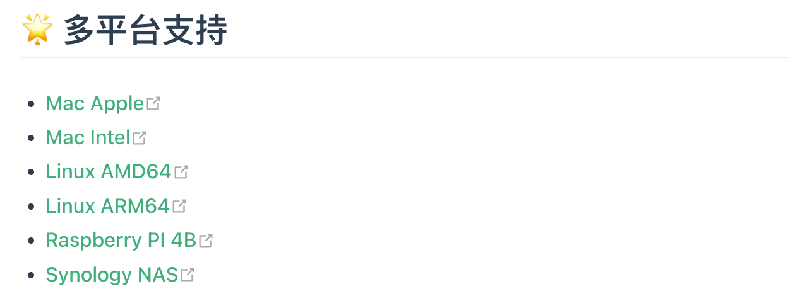

# Docker容器运行

```
docker run --name botman -d PublicHost=http://localhost botmancc/botman:v0.5.1
```


# 二进制文件运行

当前二进制执行文件支持在以下系统上直接运行：

> Linux amd64
>
> Linux arm(例如树莓派4B、群晖NAS)
>
> Mac (M1/M2/Intel cpu)


- 步骤1 : 

  进入 [https://iolinker.com](https://iolinker.com) 官网，根据自己当前系统下载对应的可执行文件。

  

- 步骤2: 

  解压到指定的文件夹下。

  ```
  tar -xvf botman-standalone-xxx-xxx-v0.5.1.tar.gz
  ```

- 步骤三: 

  运行可执行文件，默认使用80端口，可访问地址为http://localhost，登陆的账号：botman，默认密码：iolinker.com。

  建议登陆后修改密码。

  ```
  ./botman
  ```

- 步骤四(查看帮助): 

  如果想要查看命令行参数，可以通过如下命令显示。

  如果部署在公网访问，可以通过-d参数指定公网访问的地址。
  
  例如下面，表示指定公网访问地址为:[http://test.com](http://test.com)。
  
  ```
  ./botman -d http://test.com
  ```
  
  ```
  ./botman -h
  
  ██████╗  ██████╗ ████████╗███╗   ███╗ █████╗ ███╗   ██╗
  ██╔══██╗██╔═══██╗╚══██╔══╝████╗ ████║██╔══██╗████╗  ██║
  ██████╔╝██║   ██║   ██║   ██╔████╔██║███████║██╔██╗ ██║
  ██╔══██╗██║   ██║   ██║   ██║╚██╔╝██║██╔══██║██║╚██╗██║
  ██████╔╝╚██████╔╝   ██║   ██║ ╚═╝ ██║██║  ██║██║ ╚████║
  ╚═════╝  ╚═════╝    ╚═╝   ╚═╝     ╚═╝╚═╝  ╚═╝╚═╝  ╚═══╝
  
  Complete documentation is available at https://iolinker.com
  
  Usage:
    Botman [flags]
  
  Flags:
    -h, --help                   help for Botman
    -d, --public_domain string   Set server's address. Usage: ./botman -d http://localhost:8080
    
  ```


# 性能与要求

- **高并发**：单机上使用同步/异步API工作流（快速工作流模式）**QPS可达到1500以上**。

- **高容量**：Crontab工作流可支持同时启用的工作流数量达到**10W**以上。
- **低消耗**：硬件要求低，1核1G以上的机器就可以运行。

```
ab -n 2000 -c 10 http://localhost/v1/api/botman/test/index
This is ApacheBench, Version 2.3 <$Revision: 1913912 $>
Copyright 1996 Adam Twiss, Zeus Technology Ltd, http://www.zeustech.net/
Licensed to The Apache Software Foundation, http://www.apache.org/

Benchmarking localhost (be patient)
Completed 200 requests
Completed 400 requests
Completed 600 requests
Completed 800 requests
Completed 1000 requests
Completed 1200 requests
Completed 1400 requests
Completed 1600 requests
Completed 1800 requests
Completed 2000 requests
Finished 2000 requests


Server Software:
Server Hostname:        localhost
Server Port:            80

Document Path:          /v1/api/botman/test/index
Document Length:        21 bytes

Concurrency Level:      10
Time taken for tests:   1.290 seconds
Complete requests:      2000
Failed requests:        0
Total transferred:      438000 bytes
HTML transferred:       42000 bytes
Requests per second:    1550.46 [#/sec] (mean)
Time per request:       6.450 [ms] (mean)
Time per request:       0.645 [ms] (mean, across all concurrent requests)
Transfer rate:          331.59 [Kbytes/sec] received

Connection Times (ms)
              min  mean[+/-sd] median   max
Connect:        0    0   0.4      0      19
Processing:     2    6   3.4      6      38
Waiting:        2    6   3.4      6      38
Total:          3    6   3.5      6      39

Percentage of the requests served within a certain time (ms)
  50%      6
  66%      6
  75%      7
  80%      7
  90%      8
  95%      9
  98%     13
  99%     31
 100%     39 (longest request)
```


