## 企业微信应用凭据

该凭据需要以下5个信息，这些信息需要登陆企业微信后台后才可以获得。

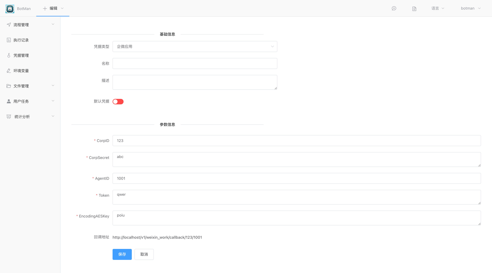

## CorpID（企业ID）

位置：【我的企业】=》【企业信息】

链接：[https://work.weixin.qq.com/wework_admin/frame#profile](https://work.weixin.qq.com/wework_admin/frame#profile)

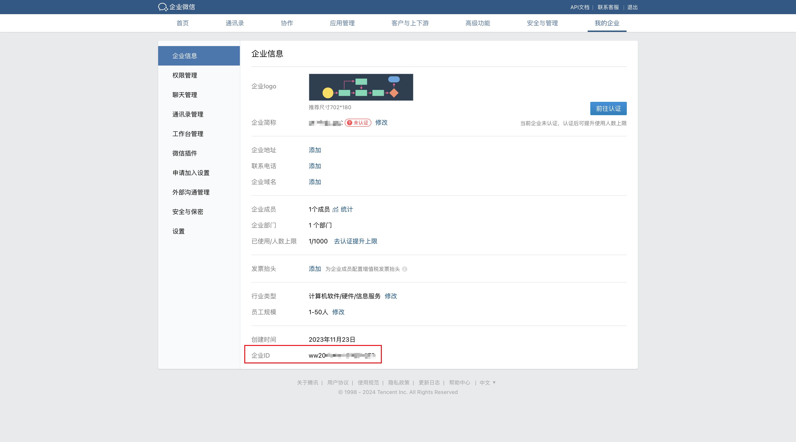

## CorpSecret

位置：【应用管理】=>【应用】=>【自建】

链接：[https://work.weixin.qq.com/wework_admin/frame#apps](https://work.weixin.qq.com/wework_admin/frame#apps)

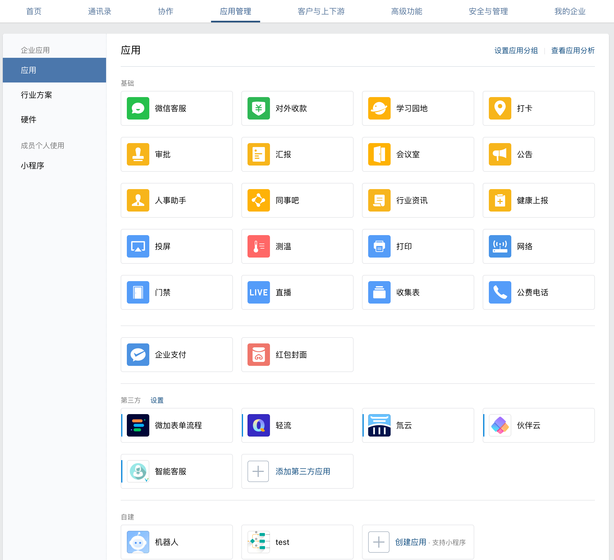

### 自建应用

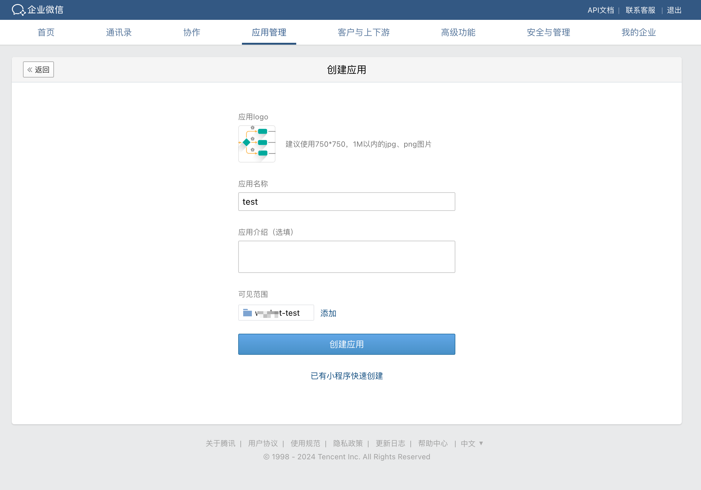

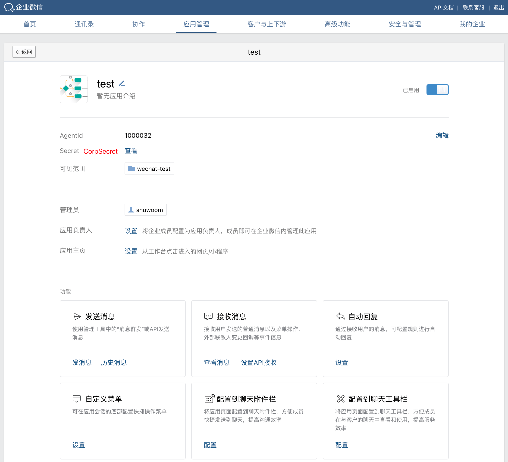

### 获取CorpSecret

点击Secret右边的【查看】按钮，可以在企业微信客户端应用上接收到我们需要的CorpSecret信息。

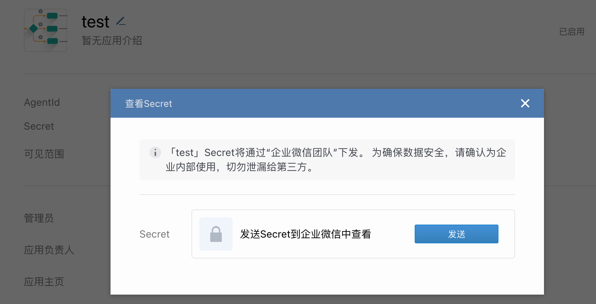

打开客户端软件，如下可以看到一条消息，点击【前往查看】按钮即可以看到CorpSecret。

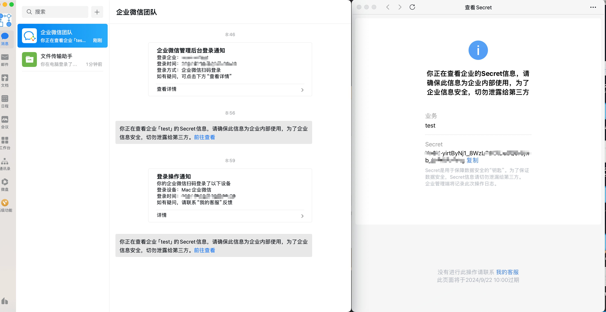

## AgentId

位置：【应用管理】=>【应用】=>【自建】

链接：[https://work.weixin.qq.com/wework_admin/frame#apps](https://work.weixin.qq.com/wework_admin/frame#apps)

如上，打开自建应用后，就可以看到AgentId。

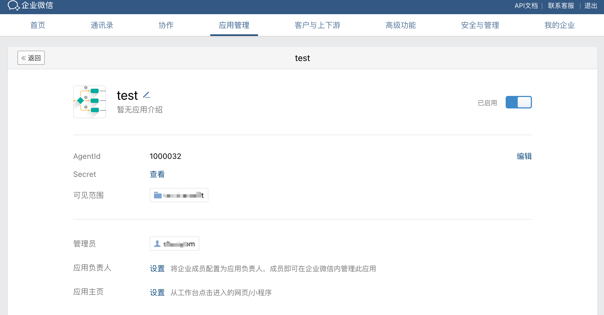

## Token和EncodingAESKey

位置：打开自建应用，进入功能选项下的【接受消息】，点击【设置API接收】按钮。

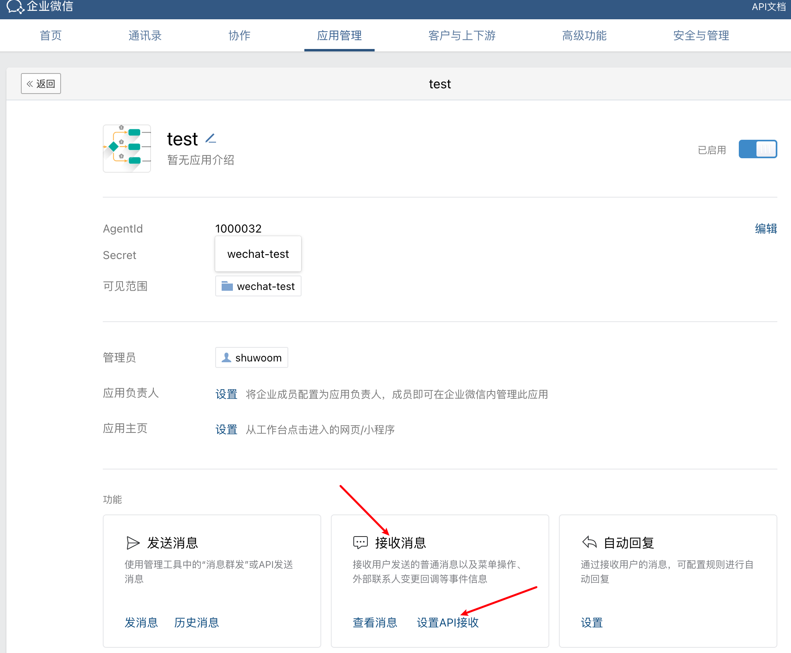

其中Token和EncodingAESKey是可以在企微平台上自动生成的。其中接收的消息类型选择如下，注意要勾选微信客服消息和事件。

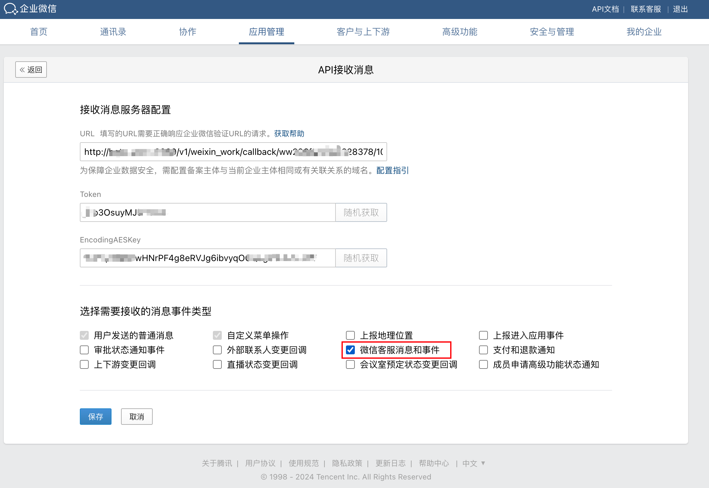

### 测试回调接口

前面我们创建保存凭据后，默认是未启用的。进入【凭据管理】，把前面创建的企微应用凭据启用。

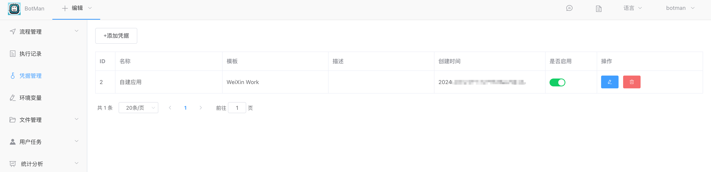

回调企业微信的自建应用的【接受消息服务器配置】，我们把前面生成的回调接口地址（`http://xxx.com/v1/weixin_work/callback/[corpId]/[agentId]`）输入进去。

点击保存后，如果接口一切正常，会提示保存成功，说明企微推送给BotMan系统的回调接口的数据解密成功，整个流程跑通了。

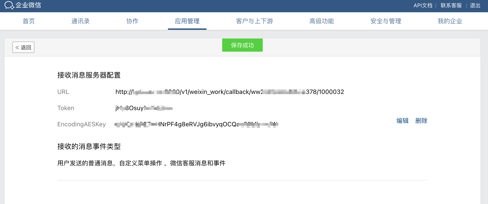

如果想了解企微跟开发者服务器的交互过程，可以参考企微的官方文档：[回调配置](https://developer.work.weixin.qq.com/document/path/90930)

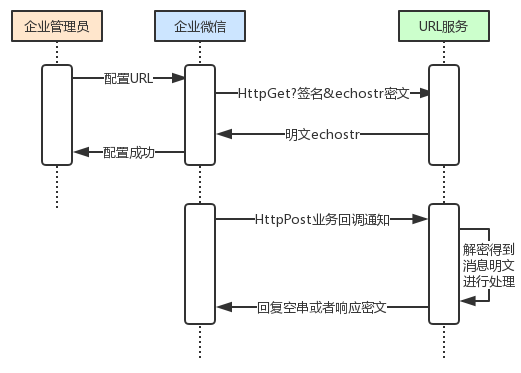