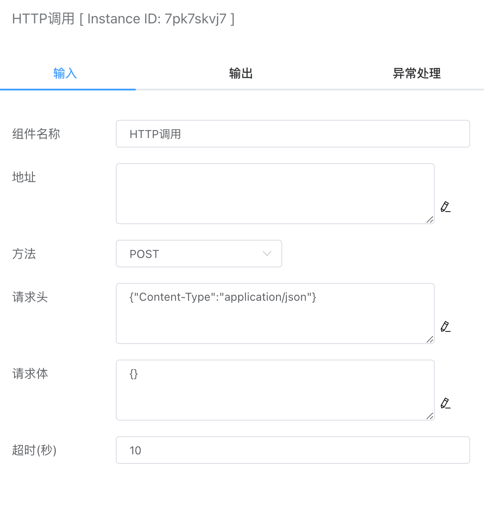

## HTTP调用

支持发送POST或GET请求。


## 入参



### 地址

请求的URL地址，支持HTTP和HTTPS协议。

### 方法

目前支持GET和POST请求方法。

### 请求头

这里使用JSON字符串的方式来表示，例如：

```json
{"Content-Type":"application/json"}
```

### 请求体

POST方法的请求体，一般用JSON字符串表示，例如：

```json
{"site":"iolinker.com"}
```

### 超时

可设置HTTP调用的超时时间，默认是10秒。


## 出参

出参返回的是HTTP的响应包各个字段，如下：

### body

响应包的消息体。

### code

响应包错误码。

### content_length

 消息体内容长度。

### header

响应体Header。


```json
{
    "body": {
        "code": 0,
        "msg": "ok"
    },
    "code": 200,
    "content_length": 21,
    "header": {
        "Content-Length": [
            "21"
        ],
        "Content-Type": [
            "application/json; charset=utf-8"
        ],
        "Date": [
            "Wed, 18 Sep 2024 14:05:00 GMT"
        ],
        "Set-Cookie": [
            "botman_uid=41be9c6324d09c5544a9ffb18908ae11; Path=/; HttpOnly"
        ]
    }
}
```


