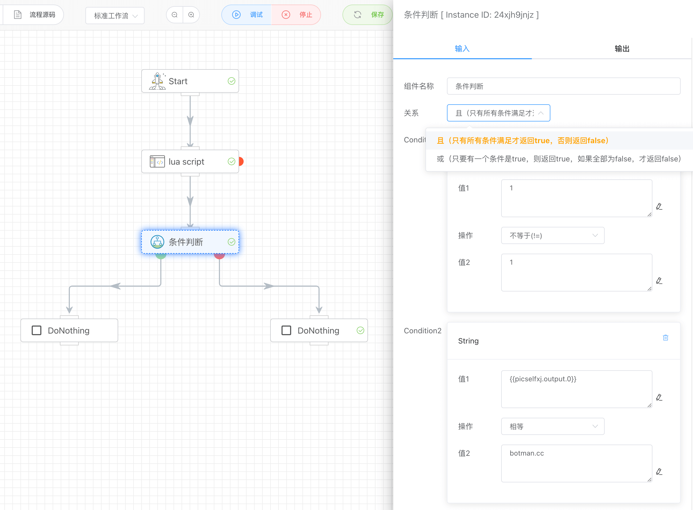
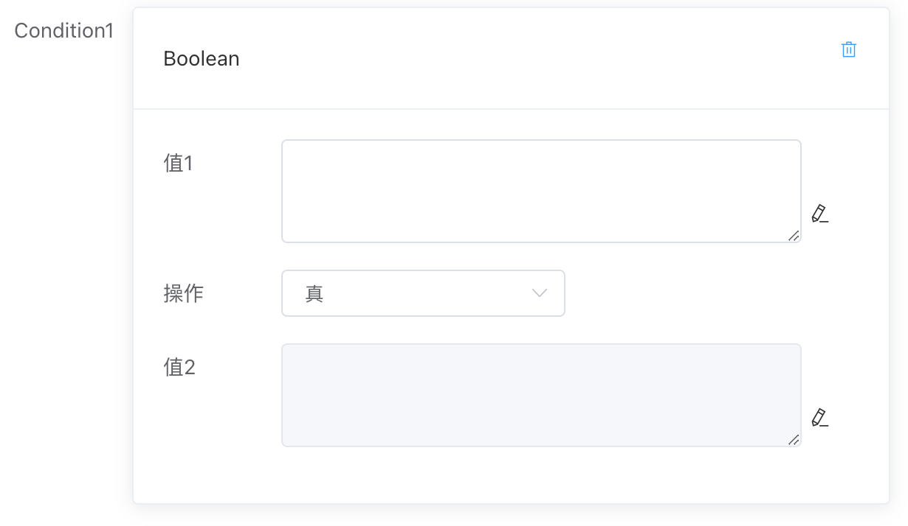
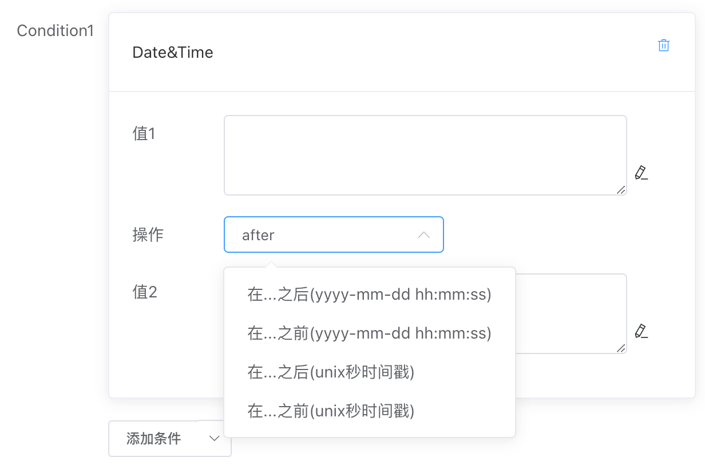
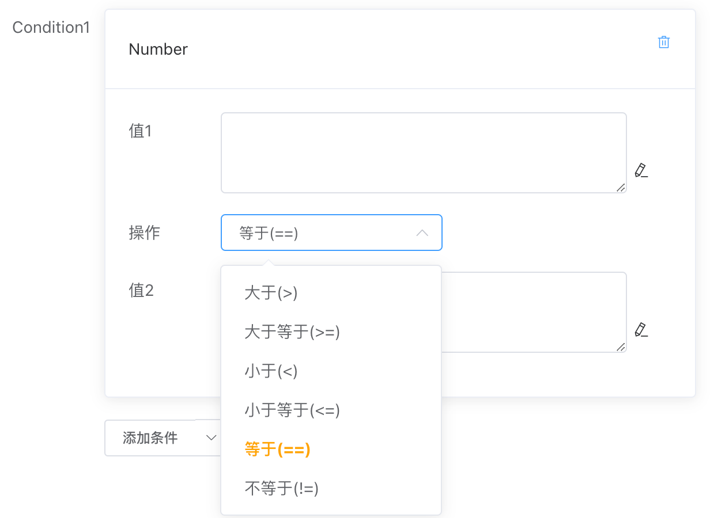
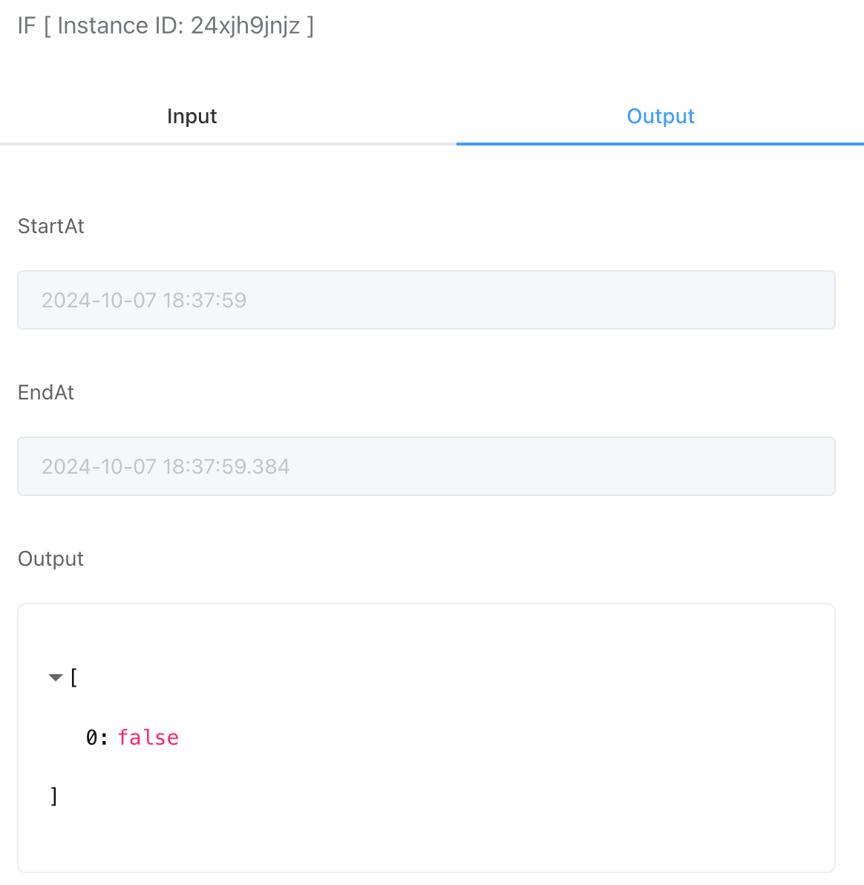

## 条件判断

根据输入判断输出是真或假，并选择对应分支执行。支持搭配使用且和或组合条件，并且可使用变量表达式在运行时动态决策。



## 入参

### 条件关系

可以通过且、或关系组成复杂的条件组合。如果组合中同时出现且和或，其关系如下：`CondX 且 CondY 或 CondZ...`

- 且

  当且仅当所有条件（条件1、条件2....条件N）都为真才返回真，否则为假

- 或

  只要任意一个条件为真，则为真，否则全部为假则为假


### 条件数值类型

当前支持布尔值、日期和时间、数字、字符串四种类型的数值类型对比。


值1和值2可以时常量，也可以时变量表达式（在运行时动态获取当前值）

#### 布尔值

判断值1是否为真或假（值2这里无用）




#### 日期和时间

比较值1和值2两者日期之间的关系，可以对比yyyy-mm-dd hh:mm:ss这样的字符串格式，也可以对比unix秒时间戳格式



#### 数字

对比值1和值2两个数字之间的大小关系，包括：

- 大于
- 大于等于
- 小于
- 小于等于
- 等于
- 不等于




#### 字符串

对比值1和值2两个字符串之间的关系，包括：

- 包含
- 不包含
- 以...开始
- 不以...开始
- 以...结尾
- 不以...结尾
- 相等
- 不相等


## 出参

```
[true/false]
```

