## IOLinker Agent智能体

### 创建LLM凭据

在【凭据管理】创建一个LLM API密钥凭据，目前LLM大模型支持包括：Deepseek、豆包、Kimi、OpenAI、千问以及开源的Ollama。


### 配置IOLinker Agent

这里可以结合Telegram触发器一起使用，可以通过Telegram发送消息给Agent，并通过Telegram消息发送APP反馈Agent的处理结果给用户。

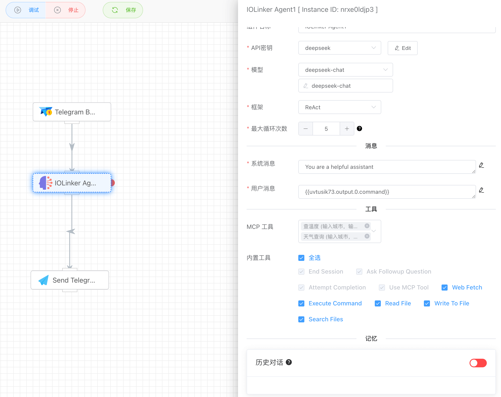


### 测试 IOLinker Agent

我们打开配置的Telegram机器人，可以直接跟机器人互动。例如询问它`能做什么`，它会基于当前的环境和能调用的外部工具给你一个反馈消息。机器人的每一次回复都是在`执行记录`列表产生一个执行记录。

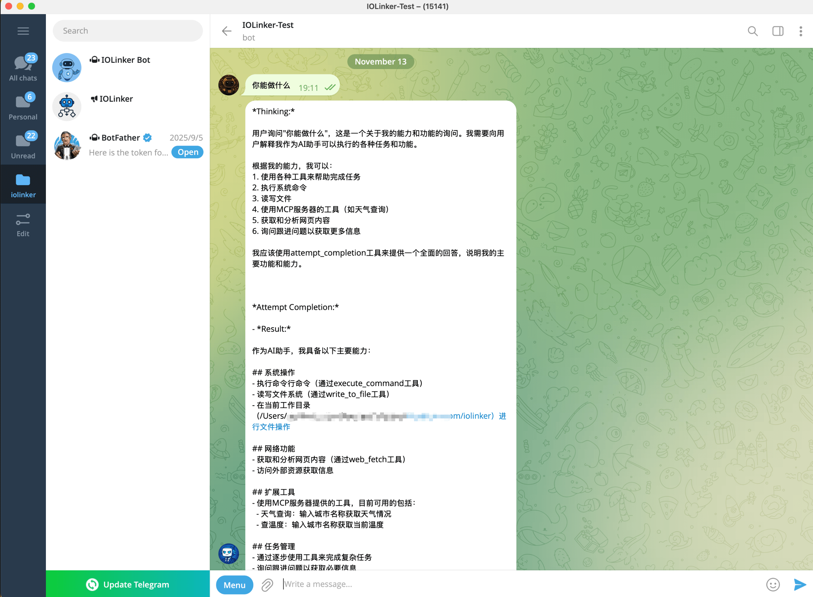


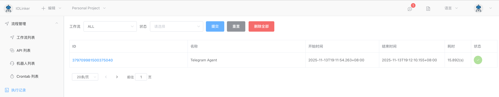

双击APP可以查看当前APP的输出结果。

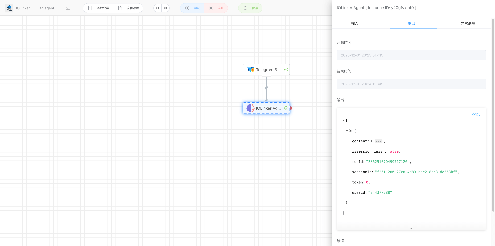

右键点击可以选择查看对话记录：

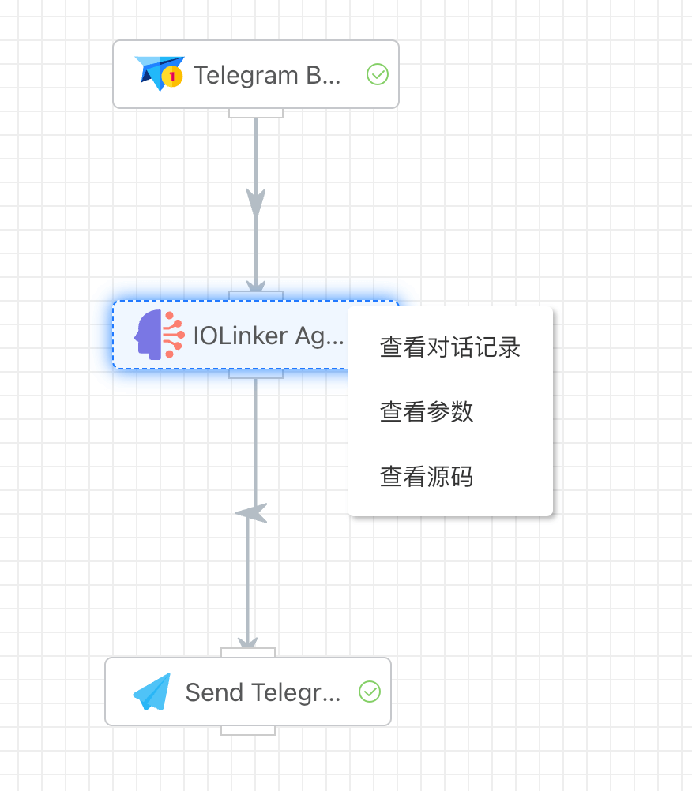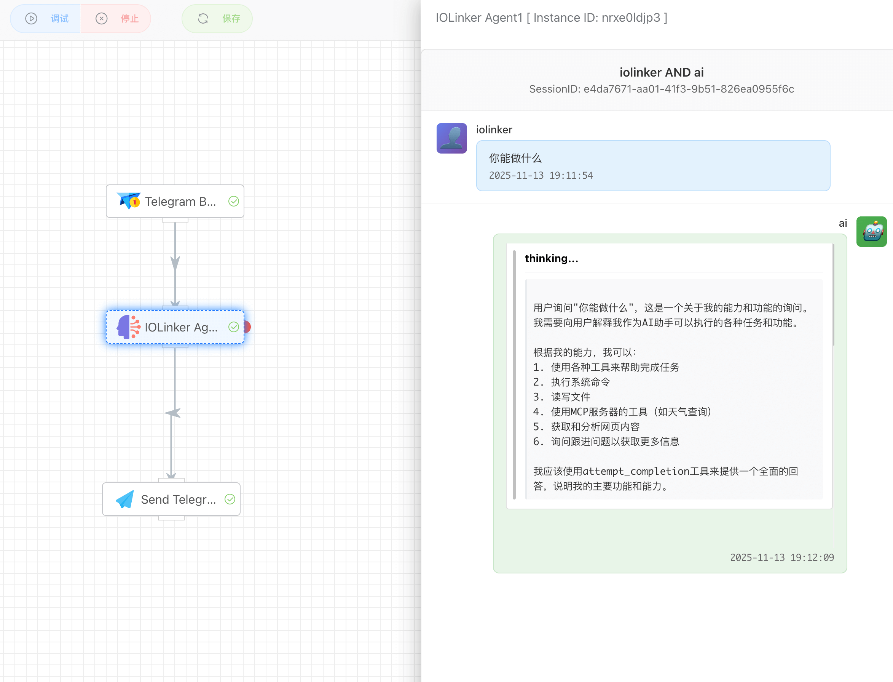

### 工具调用

当我们想要查询天气时，Agent发现有对应的MCP工具，它会自动规划请求的参数并发起调用。

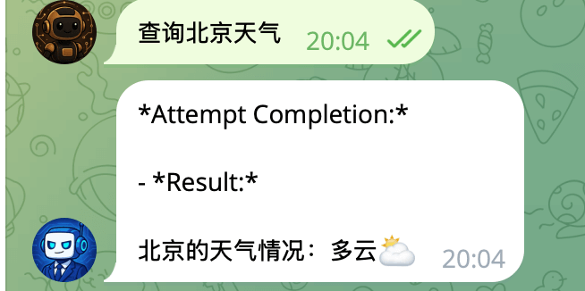

由于Agent调用了MCP工具，所以这里除了Agent的执行记录，还有一个mcp的执行记录。

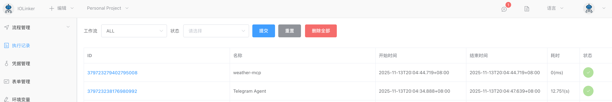

我们可以在执行详情查看到Agent跟用户的完整交互过程，也可以看到它是如何思考和调用工具的。

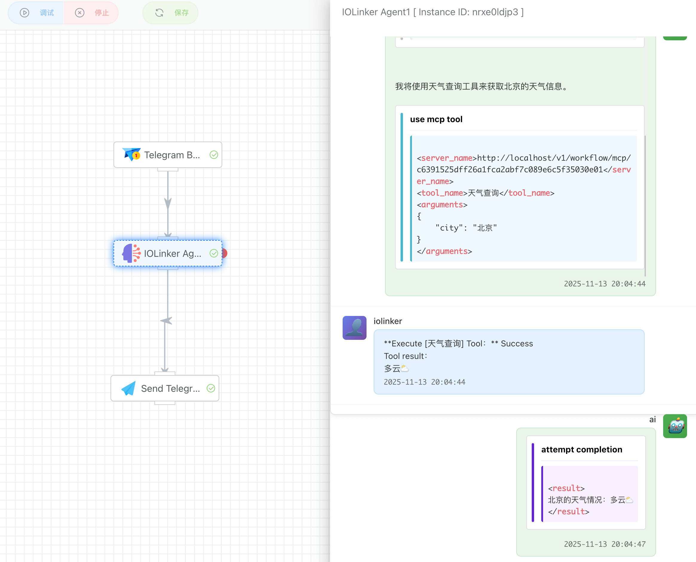

## 输入


### API密钥

可以选择在凭据管理创建的LLM API密钥。


### 模型

系统会根据当前选择的LLM厂商平台类型返回支持的模型列表，如果有模型不在返回的下拉列表中，可以直接在编辑框输入。


### 框架

**ReAct** 是一个让AI智能体（Agent）通过**推理**和**行动**来解决问题的框架。它的核心思想是：**不让AI直接给出答案，而是让它像人类一样“思考-行动-再思考”的循环过程来完成任务。**

ReAct的工作流程是一个典型的循环，可以概括为以下三个步骤，并不断重复直到问题解决：

**思考 → 行动 → 观察**

1. **思考**AI分析当前的问题和已经获得的信息。**关键：AI必须用文字形式写出它的思考过程。** 例如：“用户问的是今天的天气，但我不知道当前日期和位置。我需要先获取当前日期，然后询问用户的位置。”这一步将AI的“内心戏”外化，使我们能追踪它的逻辑，也帮助它自己理清思路。
2. **行动**基于上一步的思考，AI决定执行一个具体的动作。动作通常是通过调用一个**工具**来完成。例如：`Search[“今日日期”]`（调用搜索工具）`Calculator[“(25 * 4) / 2”]`（调用计算器工具）`BrowseWebsite[“某个URL”]`（调用浏览器工具）甚至可以直接向用户提问：`AskUser[“请问您所在的城市是？”]`
3. **观察**行动执行后，环境（或工具）会返回一个结果。AI接收并记录这个结果。例如，搜索“今日日期”后，观察到结果是“2024年5月20日”。这个观察结果成为了解决问题的新信息。

然后，循环继续：AI基于所有现有信息（原始问题 + 新观察到的结果）进行**新一轮的思考**，决定下一步行动，如此往复，直到它认为有足够的信息可以给出最终答案。


### 最大循环次数

设置Agent基于ReAct框架循环的最大次数，即限制`思考 → 行动 → 观察`循环次数，避免Agent陷入无尽的死循环中。


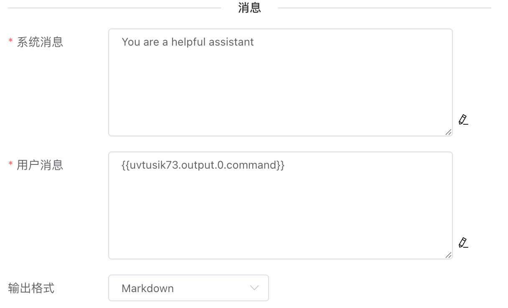


### 系统消息

定义AI Agent的“人设”、角色、行为准则和对话边界。


### 用户消息

给Agent下发具体的任务指令。


### 输出格式

设置Agent输出的字符串格式。

- Raw(XML)。这个是Agent原生的输出格式，在字符串中会带有一些xml的内容，记录Agent的思考过程以及一些工具调用。
- Markdown。将上面的xml标记转换成markdown格式。
- 

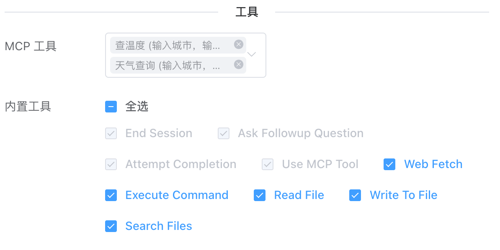

### MCP 工具

这里可以选择在工作流列表中的MCP 触发器创建的MCP Server工具。勾选后，Agent会在分析时根据任务选择对应的工具调用。


### 内置工具

这里是系统自身自带的工具，用户可以根据实际需要勾选。

- End Session。

  ```
  这个是结束当前会话或者发起新的会话。当用户对Agent下发诸如结束、重新开始会话等明显的结束意图时，Agent会认为用户想要结束当前会话或发起新的会话。
  ```

  注意：一个会话会涉及到多个对话记录，可能涉及多次的工作流执行。

- Ask Followup Question

  ```
  Agent向用户提问以收集完成任务所需的其他信息。当遇到歧义、需要澄清或需要更多细节才能有效推进时，Agent会使用此工具。它支持与用户直接沟通，从而实现交互式问题解决。
  ```

- Attempt Completion

  ```
  Agent每次使用工具后，用户都会反馈工具使用结果，即成功或失败，以及失败原因。收到工具使用结果并确认任务完成后，Agent会使用此工具向用户展示工作成果。
  ```

- Use MCP Tool

  ```
  Agent会根据实际情况请求使用已连接的 MCP 服务器提供的工具。每个 MCP 服务器可以提供多个功能各异的工具。
  ```

- Web Fetch

  ```
  当Agent认为需要检索和分析网页内容时，会使用此工具。
  ```

- Execute Command

  ```
  当Agent认为需要执行系统操作或运行特定命令来完成用户任务中的任何步骤时，会使用此功能在系统上执行 CLI 命令。
  ```

- Read File

  ```
  当Agent认为需要检查一个未知内容的现有文件时，例如分析代码、查看文本文件或从配置文件中提取信息，会使用此功能请求读取指定路径下文件的内容。
  ```

- Write To File

  ```
  请求将内容写入指定路径的文件。如果文件已存在，则会用提供的内容覆盖它。如果文件不存在，则会创建该文件。此工具会自动创建写入文件所需的任何目录。
  ```

- Search Files

  ```
  请求对指定目录中的文件执行正则表达式搜索，并提供包含上下文信息的结果。
  ```


### 历史对话

开启历史对话功能后，Agent可以实现记忆功能，实现连贯对话。

- 对话轮数：加载最近n轮的历史对话记录，最大可加载1000轮对话。
- 对话时间：加载最近n分钟前的历史对话记录，最大可加载10天内的对话。


## 输出

- content：Agent返回的结果
- isSessionFinish：表示当前会话是否结束。如果未开启历史对话功能，则该值已知为true，表示对话是一次性的。如果开启了历史对话功能，由于会话涉及多轮，中间运行结果该值为false，只有用于明显发出结束意图时，Agent会调用`End Session`工具结束会话，并设置该值为true
- sessionId：会话ID，如果开启历史对话，则中间产生的sessionId是相同的，表示是同一个会话。
- userId：会话用户。

```
[
    {
        "content": "....",
        "isSessionFinish": true,
        "runId": "379709981500375040",
        "sessionId": "e4da7671-aa01-41f3-9b51-826ea0955f6c",
        "token": 0,
        "userId": "iolinker"
    }
]
```

