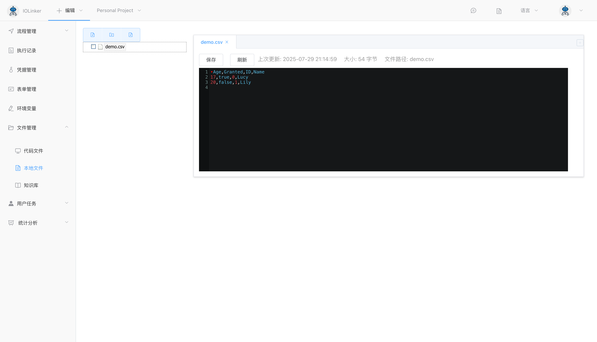

## JSON转CSV文件

可以把Json数据(数组)转换成csv文件。


写入成功的文件可以在【文件管理】下的【本地文件】查看到，并且可以在这里进行编辑和更新。





<iframe 
    width="800" 
    height="600" 
    src="https://www.youtube.com/embed/NU_r3PXgsC0"  frameborder="0" 
    allow="accelerometer; autoplay; encrypted-media; gyroscope; picture-in-picture" 
    allowfullscreen>
</iframe>

## 入参


### 文件名

保存的文件名，例如：test。无需加后缀.csv，系统会自动添加。


### 操作

- 覆盖

  如果有同名的文件，则覆盖该文件数据，如果没有同名文件，则新建文件。

- 删除文件

  删除指定的文件名。

### 内容

写入的JSON数组文本数据内容。


## 出参

输出csv文件路径。

```json
[
  {
    "filepath": "space/alyyd551jg/aa.csv"
  }
]
```
