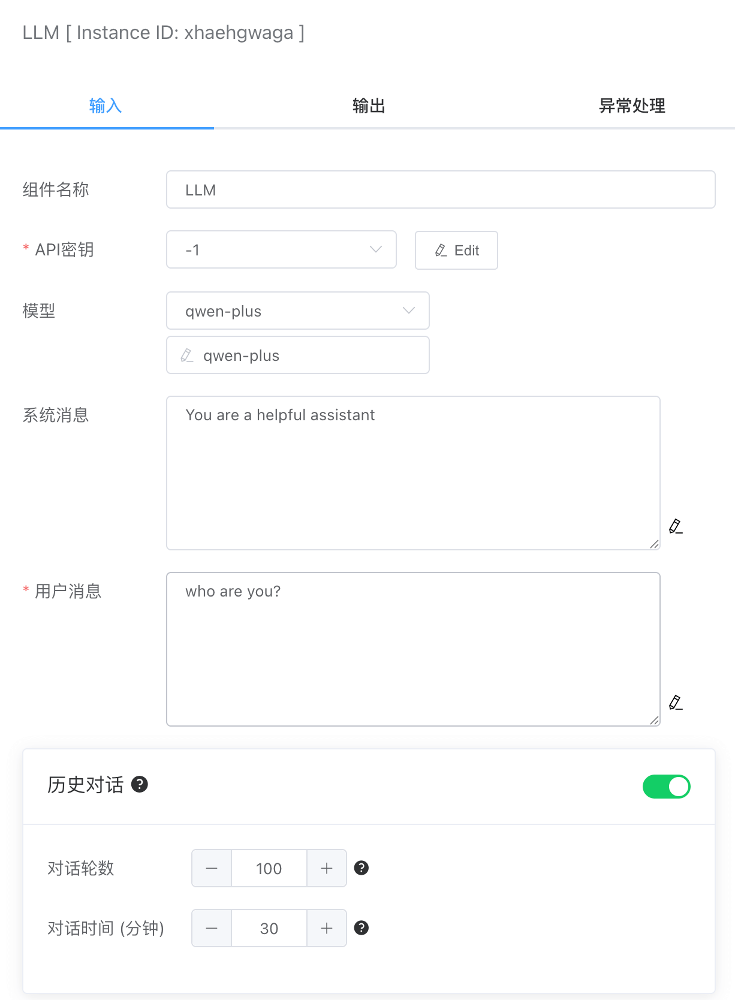
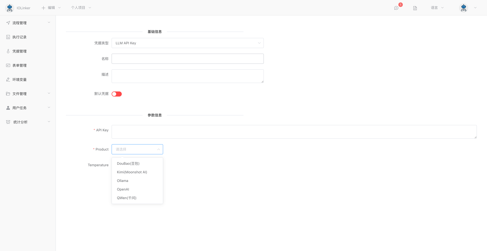
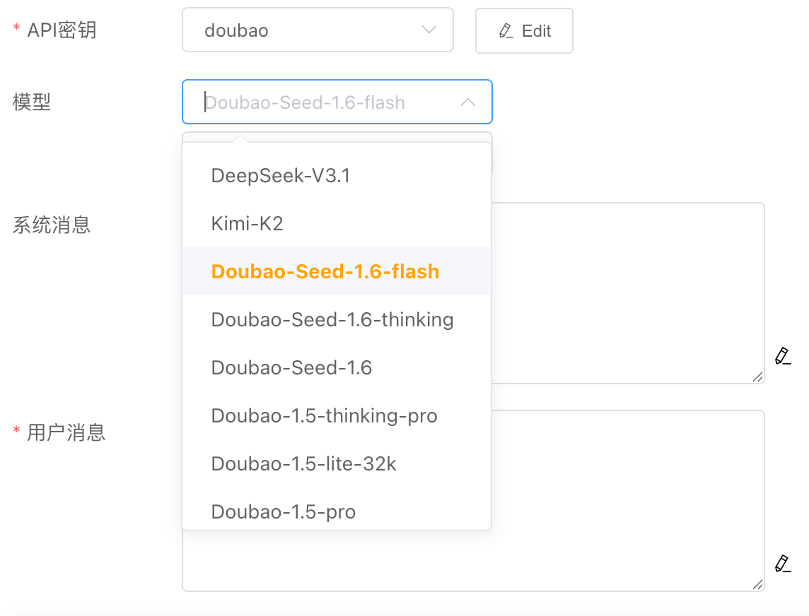
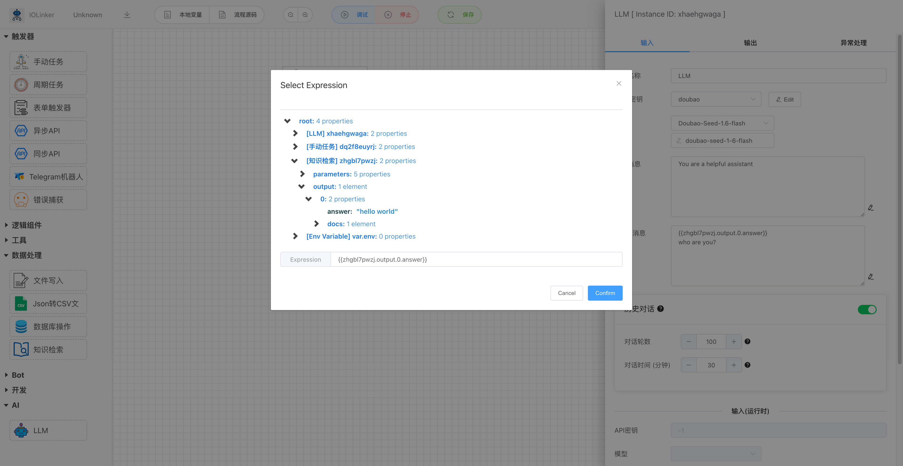
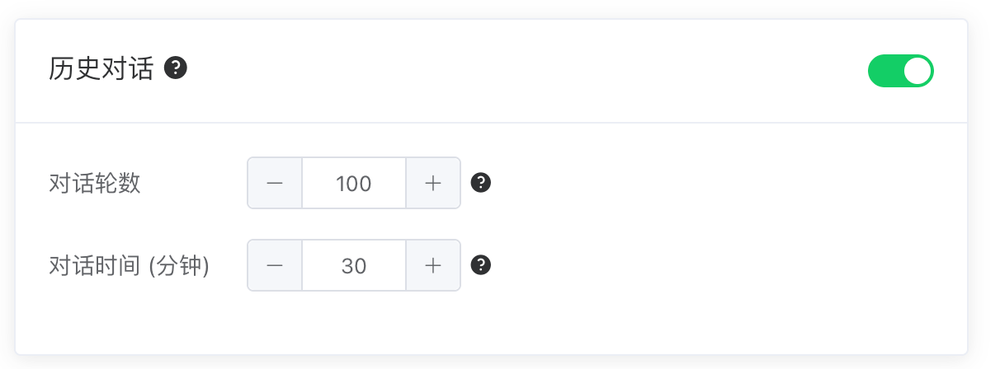
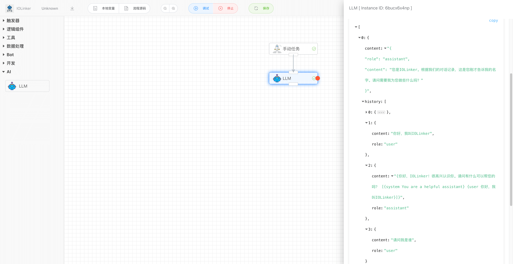

## LLM大模型

集成支持主流的LLM大模型，包括OpenAI、千问（QWen）、豆包、Kimi和开源的Ollama，支持记忆功能开启（加载历史对话记录），使得对话更连贯，支持对异常进行失败重试、捕获响应等错误处理机制。


## 输入




### API 秘钥

可在【凭据管理】里创建大模型API Key凭据类型。需要配置如下几个选项：

- Product：大模型产商，包括：豆包、Kimi、Ollama、OpenAI和千问

- API Key。各个产商平台生成的API Key




### 模型

选择不同产商的LLM凭据，可以选择不同的模型，如果想要的模型不在列表里，可以手动输入模型名称。




### 系统消息

系统消息就是给LLM设定一个角色、人设，例如常见的：你是一个很有帮助的AI助理等，这样可以让LLM的回答更专业、更准确。


### 用户消息

就是用户的提问内容，这里可以使用变量表达式的功能，集成工作流中其他APP节点的输出。



### 历史对话

启用历史对话功能，可以把历史某段事件内的对话内容加载到LLM中，这样可以使得LLM有类似人类大脑记忆的功能，使得对话显得更加连贯。但是加载的历史对话轮数越多，则会越消耗Token。



例如下面就把上一次的历史对话记录加载到LLM，使得LLM有记忆的功能。




## 输出

如下是一个连贯的对话记录，里面会包含历史加载的对话数据和当前提问的回答。

History中role有三种角色，分别是system、user和assistant。

```json
[
  {
    "content": "{\n    \"role\": \"assistant\",\n    \"content\": \"您是IOLinker。根据我们的对话记录，这是您刚才告诉我的名字。请问需要我为您做些什么吗？\"\n}",
    "history": [
      {
        "content": "You are a helpful assistant",
        "role": "system"
      },
      {
        "content": "你好，我叫IOLinker",
        "role": "user"
      },
      {
        "content": "{你好，IOLinker！很高兴认识你。请问有什么可以帮您的吗？ [{system You are a helpful assistant} {user 你好，我叫IOLinker}]}",
        "role": "assistant"
      },
      {
        "content": "请问我是谁",
        "role": "user"
      }
    ]
  }
]
```


