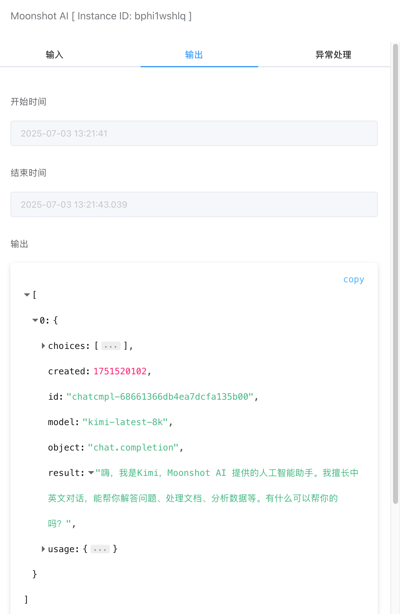

## Moonshot AI

通过[Moonshot](https://platform.moonshot.cn/console/api-keys)平台的API，调用大模型接口，该平台有一定的免费Token额度可以使用。


## 输入


### API Key

可在【凭据管理】里创建Moonshot API Key凭据类型。需要配置如下几个选项：

- API Key。[Moonshot](https://platform.moonshot.cn/console/api-keys)平台生成的API Key。


### 模型

当前支持的模型，可以参考官方[文档](https://platform.moonshot.cn/docs/introduction#%E5%85%B6%E4%BB%96%E5%80%BC%E5%BE%97%E6%B3%A8%E6%84%8F%E7%9A%84%E9%87%8D%E8%A6%81%E4%BA%8B%E9%A1%B9)。


### 输入

提示语内容。


### Temperature

参考[官方文档](https://platform.moonshot.cn/docs/guide/migrating-from-openai-to-kimi#temperature-%E5%92%8C-n-%E5%80%BC)，一般使用默认值即可。

## 输出




完整输出如下：

```
[
  {
    "choices": [
      {
        "finish_reason": "stop",
        "index": 0,
        "message": {
          "content": "嗨，我是Kimi，Moonshot AI 提供的人工智能助手。我擅长中英文对话，能帮你解答问题、处理文档、分析数据等。有什么可以帮你的吗？",
          "role": "assistant"
        }
      }
    ],
    "created": 1751520102,
    "id": "chatcmpl-68661366db4ea7dcfa135b00",
    "model": "kimi-latest-8k",
    "object": "chat.completion",
    "result": "嗨，我是Kimi，Moonshot AI 提供的人工智能助手。我擅长中英文对话，能帮你解答问题、处理文档、分析数据等。有什么可以帮你的吗？",
    "usage": {
      "completion_tokens": 41,
      "prompt_tokens": 80,
      "total_tokens": 121
    }
  }
]
```

