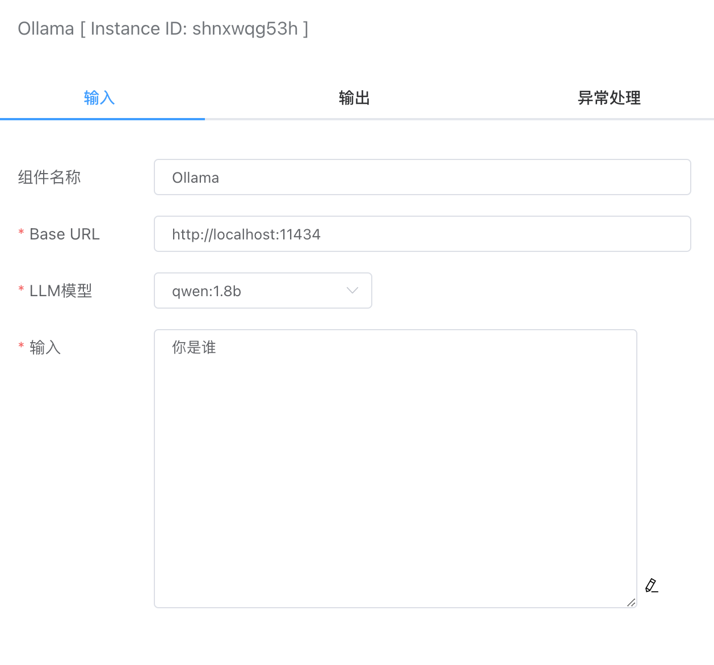

## Ollama

Ollama是一个轻量级、可扩展的框架，专为在本地机器上构建和运行大型语言模型而设计。它提供了类似OpenAI的API接口和聊天界面，使得部署和使用最新版本的GPT模型变得异常简单。


## 输入



### Base URL

本地ollama服务器地址，默认是：http://localhost:11434


### LLM模型

这里调用的是ollama服务器的接口：[List Local Models](https://github.com/ollama/ollama/blob/main/docs/api.md#list-local-models)

```
curl http://localhost:11434/api/tags
```


### 输入

提示语内容。


## 输出

- response。这里是大模型的输出结果。
- model。使用的本地模型。

上文输入的输出结果如下：

```json
{
    "model": "qwen:1.8b",
    "response": "我是来自阿里云的大规模语言模型，我叫通义千问。通义千问是一个基于大型预训练模型的多模态对话系统，可以理解和回答多种自然语言处理任务，如文本分类、情感分析、机器翻译等。\n\n通义千问能够进行多模态对话，主要是利用了预训练模型的知识和语义理解能力。在多模态对话中，通义千问会根据用户的提问和上下文信息，从多个预训练模型中选择最合适的模型特征和语义知识，然后生成与用户问题相关、具有适当语法结构的自然语言文本回复给用户。\n\n通过这种方式，通义千问可以有效地理解和回答多种多模态对话任务，从而为用户提供更丰富、更个性化的多模态对话体验。"
}
```

