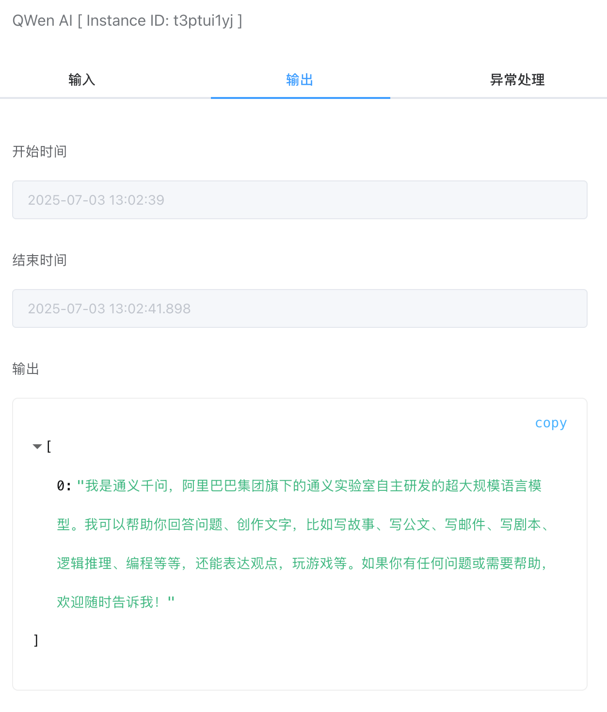

## 通义千问AI

通过[阿里云百炼](https://bailian.console.aliyun.com/?tab=home#/home)平台的API，调用通义千问大模型接口，该平台有一定的免费Token额度可以使用。

## 输入

### API Key

可在【凭据管理】里创建通义千问API Key凭据类型。需要配置如下几个选项：

- API Key。[阿里云百炼](https://bailian.console.aliyun.com/?tab=model#/api-key)平台生成的API Key。

### 模型

当前支持的模型，可以参考官方[文档](https://bailian.console.aliyun.com/?tab=doc#/api/?type=model&url=https%3A%2F%2Fhelp.aliyun.com%2Fdocument_detail%2F2840914.html%239f8890ce29g5u)。

### 输入

提示语内容。

## 输出

