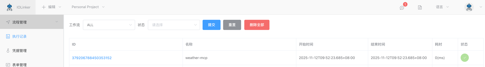
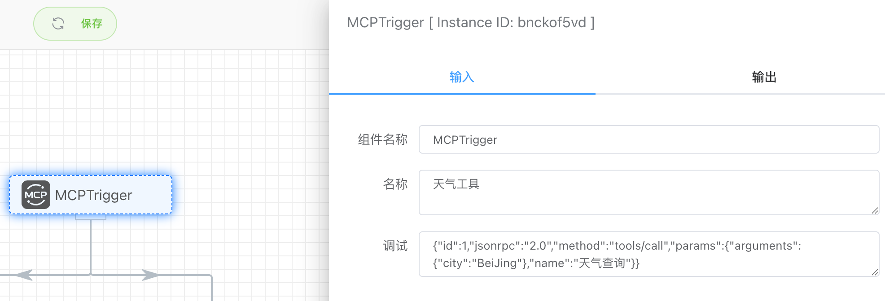
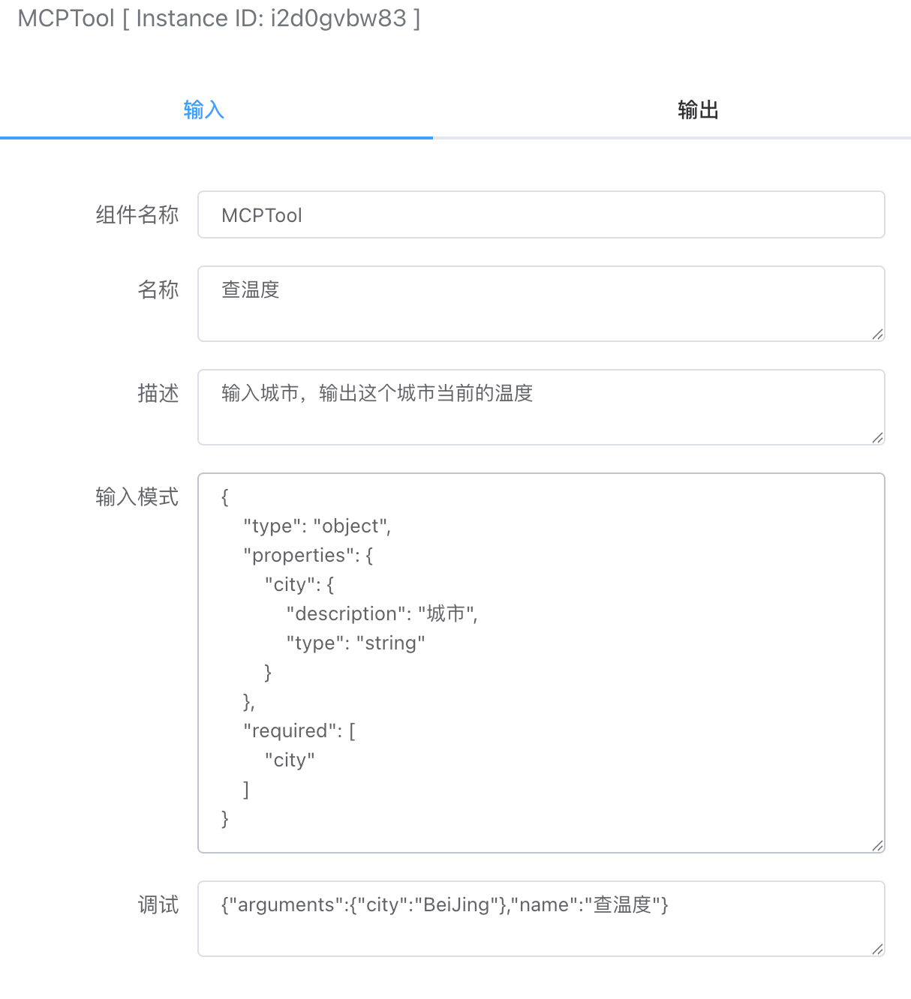

## MCP Server

### 创建MCP Server工作流

MCP Server的开发，需要组合使用MCP触发器和MCP工具两个app一起使用才能实现。

MCP触发器会根据客户端请求的工具名称，选择对应的路由分支执行工具APP。


创建好MCP Server工作流后，可以在【工作流列表】查看到该MCP Server的地址，拿到地址后就可以在诸如Cherry Studio、Cline等第三方客户端配置MCP Server使用。


### 客户端配置MCP Server
如下是CherryStudio跟MCP Server建立连接后查询到的工具列表：


Cherry Studio跟MCP Server建立连接后，会查询工具列表，这里可以看到工具列表跟工作流中的对应关系。


### 调用MCP Server
在CherryStudio上勾选了MCP工具之后，我们请求大模型`北京天气情况`，大模型会根据工具列表，选择符合的工具取请求，并将返回的结果反馈给用户，如下图所示：


### 查看执行记录
上面大模型调用MCP Server后，我们可以到工作流平台的【执行记录】查看到对应的执行记录详情：




## MCP 触发器

### 入参



#### 名称

设置当前MCP Server的名称


#### 调试

在开发MCP Server时，可以模拟客户端发送的请求参数，方便调试使用。这里如果想要模拟调用某个MCP工具，只需修改name为对应工具名称，同时在arguments传递对应的json参数即可。

```json
{
    "id": 1,
    "jsonrpc": "2.0",
    "method": "tools/call",
    "params": {
        "arguments": {
            "city": "BeiJing"
        },
        "name": "天气查询"
    }
}
```


### 出参

出参主要显示MCP客户端传递的完整请求参数，例如下面：

```json
[
  {
    "id": 1,
    "jsonrpc": "2.0",
    "method": "tools/call",
    "params": {
      "arguments": {
        "city": "BeiJing"
      },
      "name": "天气查询"
    }
  }
]
```


## MCP 工具

### 入参



#### 名称
这里设置的是MCP工具名称，设置后，可以在第三方的客户端工具显示。


#### 描述
这里设置的是MCP工具描述，设置后，可以在第三方的客户端工具显示。


#### 输入模式

设置MCP工具的入参格式，该JSON格式按照MCP协议格式要求实现。这些格式说明主要是返回给第三方的MCP客户端工具查看使用。当大模型传递的参数不符合入参格式要求，MCP Server会报错提示。

- type：这里默认是object，不需要改

- properties：设置入参的属性。采用key、value方式设置，key是入参名称，value是一个json结构体，包含description和type两个属性

  - description：描述入参字段
  - type：描述入参类型，包括：string、number、array、boolean、object

- required：设置哪些入参字段是必填字段

  

```json
{
    "type": "object",
    "properties": {
        "city": {
            "description": "城市",
            "type": "string"
        }
    },
    "required": [
        "city"
    ]
}
```


### 出参

出参主要显示MCP客户端传递的工具参数，例如下面：

```json
[
  {
    "id": "386244421319917568",
    "jsonrpc": "2.0",
    "method": "tools/call",
    "params": {
    "arguments": {
      "city": "BeiJing"
    },
    "name": "天气查询"
  }
  }
]
```

