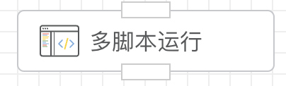
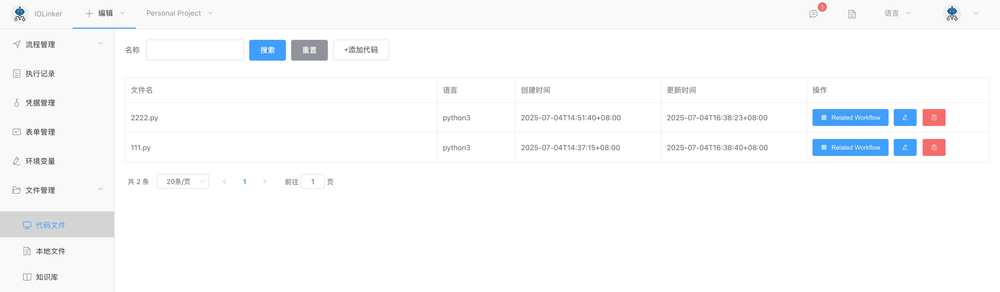

## 多脚本运行

可实现多个脚本并发同时运行或串行依次运行。



## 入参


### 语言

> 本地原生虚拟机

- Python3
- JavaScript
- PHP
- LUA
- SHELL

注意：本地原生虚拟机依赖当前机器环境，如果没有对应的虚拟机，则无法执行脚本。


### 代码片段

代码片段会显示【文件管理】->【代码文件】下对应编程语言列表。




### 运行模式

- 并行运行

  选择的脚本同时运行，可以提高执行效率。

- 串行运行

  选择的脚本依次运行，只有等前面的脚本执行完后才接着执行后续的脚本。


### 超时

设置脚本执行的超时时间，超过该时间，系统会强制终止，并输出错误信息：

```json
{
    "WorkflowId": 0,
    "WorkflowName": "Unknown",
    "ExecutionUid": "227174016812625920",
    "ErrorAppName": "代码执行",
    "ErrorAppInstId": "oj2ku2mtzs",
    "Error": "execute command timeout",
    "CreateAt": "xxx"
}
```


## 出参

由于可以选择多个脚本执行输出，所以其输出结构如下Key、Value形式：

```
{
    "/botman/snippet/botman/111.py": "ok",
    "/botman/snippet/botman/222.py": "ok222"
}
```


这里，终端的输出会作为该APP的输出结果，例如：

- Python3

  输出可以使用`print`：

  ```python
  print('xxx')
  ```

  注意：`print`方法默认是带换行的，会影响输出。如果想要输出不带换行，可以使用如下：

  ```python
  print('xx', end='')
  ```

- JavaScript

  输出可以使用`console.log`：

  ```
  console.log('xxx')
  ```

- PHP

  输出可以使用`echo`：

  ```php
  <?php
  echo "123";
  ```

