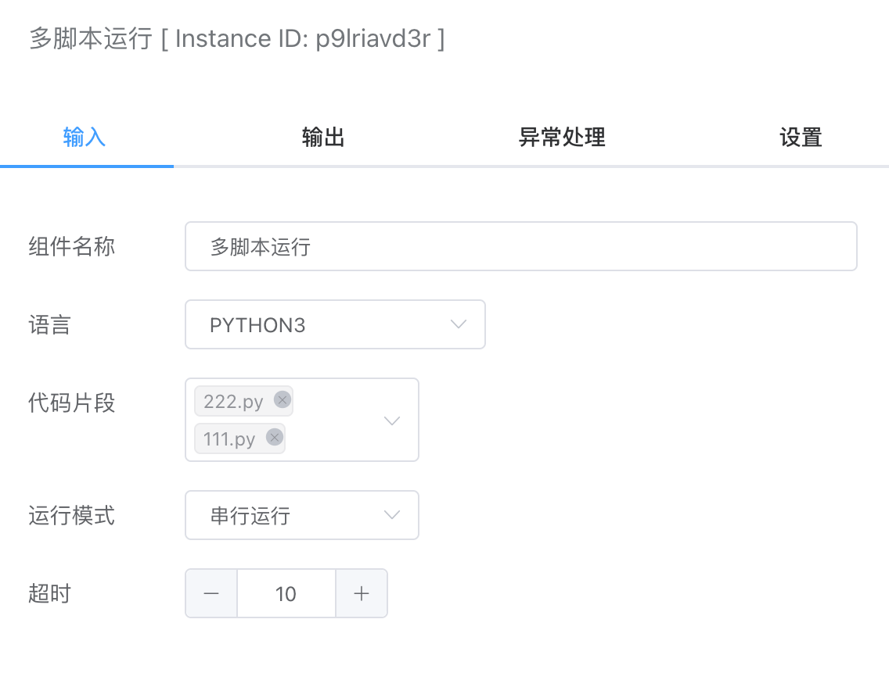
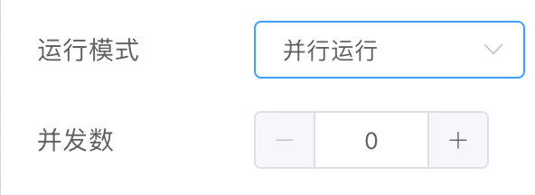
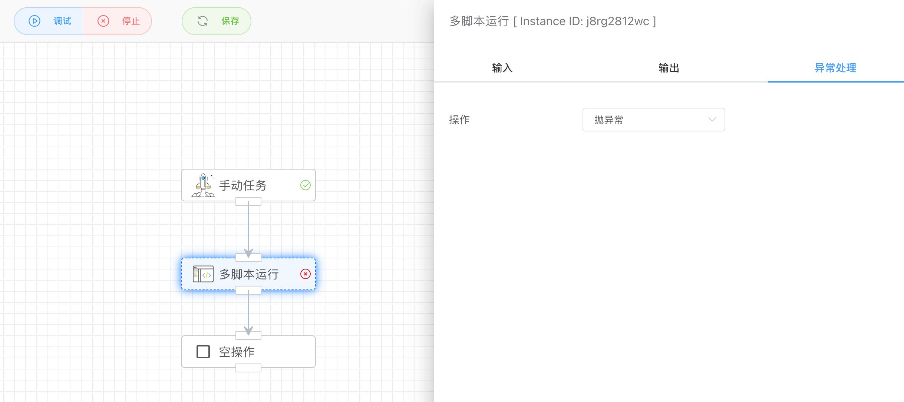
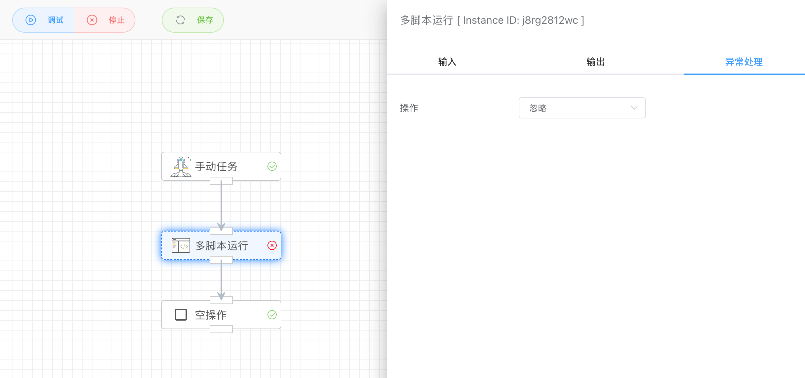

## 多脚本运行

可实现多个脚本并发同时运行或串行依次运行。


## 入参



### 语言

> 本地原生虚拟机

- Python3
- JavaScript
- PHP
- LUA
- SHELL

注意：本地原生虚拟机依赖当前机器环境，如果没有对应的虚拟机，则无法执行脚本。


### 代码片段

代码片段会显示【文件管理】->【代码文件】下对应编程语言列表。


### 运行模式

- 并行运行

  选择的脚本同时运行，可以提高执行效率。可以设置运行时并发的脚本数量，默认为0表示所有脚本同时并发执行。

  

- 串行运行

  选择的脚本依次运行，只有等前面的脚本执行完后才接着执行后续的脚本。


### 超时

设置脚本执行的超时时间，超过该时间，系统会强制终止，并输出错误信息：

```json
[
  {
    "./snippet/xqnnyrdgdv/111.py": {
      "cost": 1004,
      "endAt": "2025-07-08 08:14:57.643",
      "error": "execute command timeout",
      "output": null,
      "startAt": "2025-07-08 08:14:56.639"
    },
    "./snippet/xqnnyrdgdv/2222.py": {
      "cost": 1004,
      "endAt": "2025-07-08 08:14:56.639",
      "error": "execute command timeout",
      "output": null,
      "startAt": "2025-07-08 08:14:55.635"
    }
  }
]
```


### 异常处理

默认情况下，App对发生的错误是抛出异常，然后停止后面的App运行，这里即使只有一个脚本异常，整个App都会报错。如果你想忽略错误继续运行，可以在异常处理的操作哪里选择忽略。



忽略错误，继续运行：



## 出参

由于可以选择多个脚本执行输出，所以其输出结构如下Key、Value形式：

```
[
  {
    "./snippet/xqnnyrdgdv/111.py": {
      "cost": 5059,
      "endAt": "2025-07-08 08:09:41.847",
      "error": "",
      "output": "hello world 111",
      "startAt": "2025-07-08 08:09:36.788"
    },
    "./snippet/xqnnyrdgdv/2222.py": {
      "cost": 3058,
      "endAt": "2025-07-08 08:09:39.846",
      "error": "",
      "output": "hello world 2222",
      "startAt": "2025-07-08 08:09:36.788"
    }
  }
]
```


这里，终端的输出会作为该APP的输出结果，例如：

- Python3

  输出可以使用`print`：

  ```python
  print('xxx')
  ```

  注意：`print`方法默认是带换行的，会影响输出。如果想要输出不带换行，可以使用如下：

  ```python
  print('xx', end='')
  ```

- JavaScript

  输出可以使用`console.log`：

  ```
  console.log('xxx')
  ```

- PHP

  输出可以使用`echo`：

  ```php
  <?php
  echo "123";
  ```

