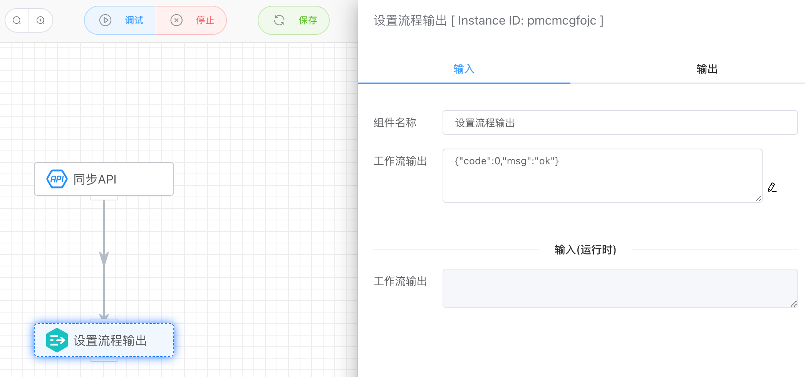

## 设置流程输出

搭配【同步API】一起使用，可以设置这个同步API的输出结果，即这个流程的输出结果。如下图，设置了一个Json输出，当请求同步API取得结果后，会把设置的Json输出作为API的输出结果返回。

```json
>> curl http://localhost/v1/api/iolinker/test/index
>> {"code":0,"msg":"ok"}
```





## 入参

- 工作流输出

  设置当前工作流的输出结果，即同步API的返回结果。


## 出参

设置什么，输出什么。