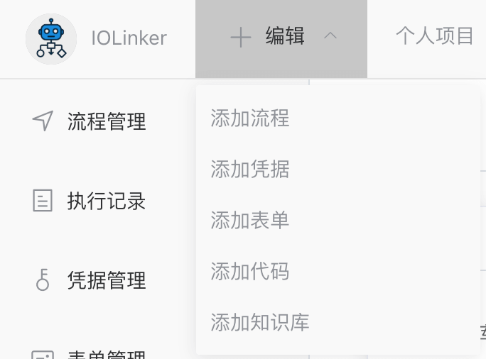
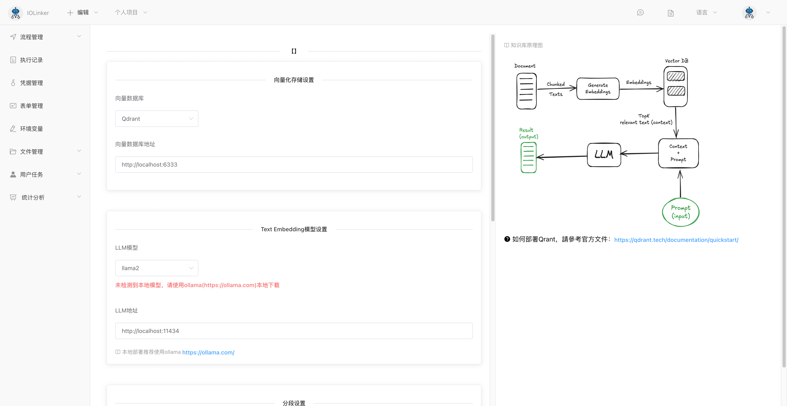
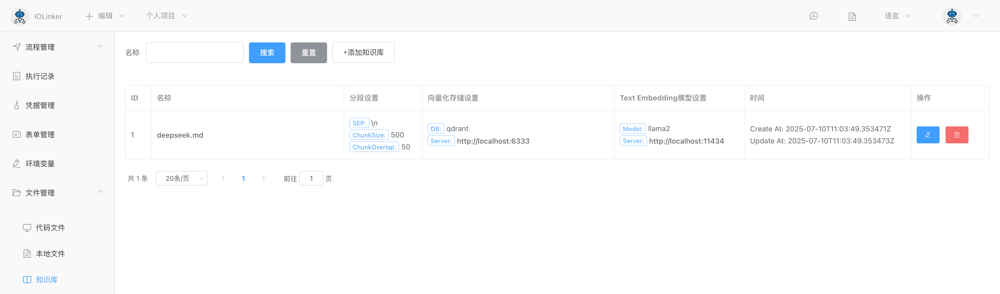
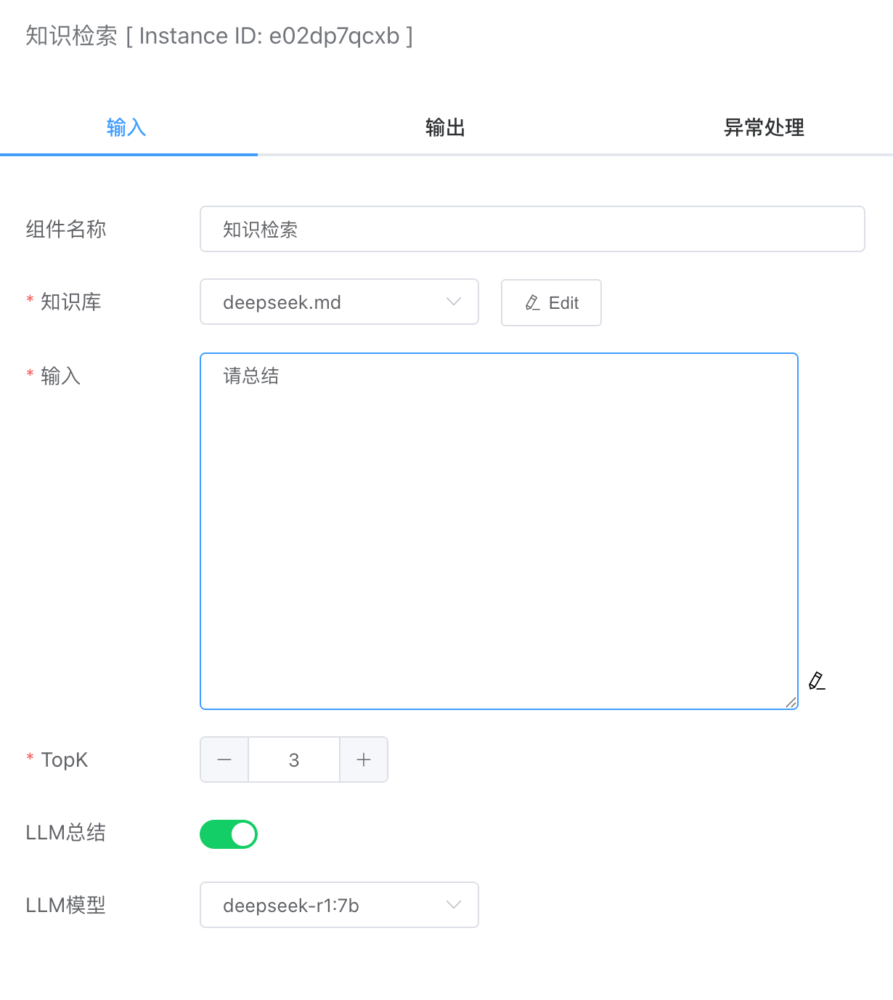
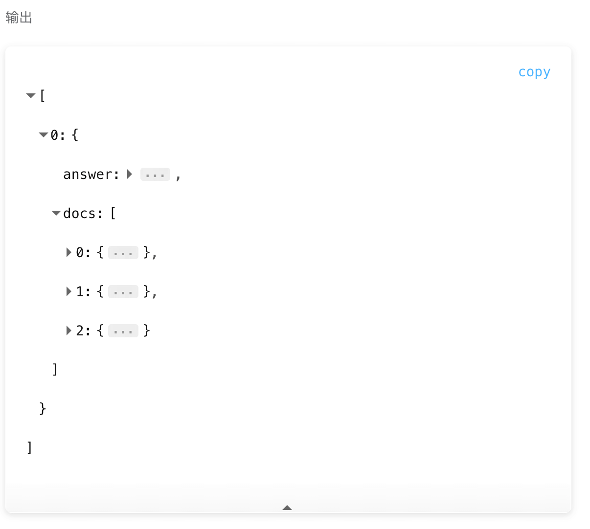

RAG（Retrieval-Augmented Generation）是一种混合方法，它结合了检索式和生成式的策略。RAG旨在提高模型在生成回答时的准确性和可靠性。它通过在大型知识库中检索相关信息，并使用生成式模型（如Transformer）来生成合适的回答。这种方法允许模型在生成回答时充分利用外部知识，从而提高了回答的质量和准确性。


如下图是RAG的完整实现流程。


- 首先是将文本存储到向量数据库中，将文档向量化
- 然后通过向量数据库的相似索引和用户输入的查询语句，找出最相似的几个关联片段
- 最后通过LLM大模型对这些返回的文档片段进行总结，输出结论


## Ollama LLM本地部署

由于我们做的是本地的RAG搭建，全程不调用商用的大模型API，所以LLM大模型用的是开源的ollama，官网地址：[https://ollama.com/](https://ollama.com/)。


ollama项目可以实现跨平台部署，支持macOS、Linux和Windows，而且部署非常简单。部署的方式可以直接登录官网查看，这里就不另外介绍。
注意：LLM对机器配置要求比较高。


## Qdrant向量数据库本地部署

本地部署qdrant数据库，推荐使用Docker，参考官网教程：https://qdrant.tech/documentation/guides/installation/#docker

```
docker pull qdrant/qdrant
docker run -p 6333:6333 qdrant/qdrant
```

部署成功之后，可以通过访问：http://localhost:6333/dashboard#/console


## 创建知识库

这里我们从网上找到一个deepseek介绍内容作为txt文档导入到向量数据库中。

点击【编辑】按钮会下拉显示【添加知识库】按钮。



如下是添加知识库的界面：



前面安装了ollama后，需要下载对应的模型到本地，下载成功后可以下拉显示出来：


文档越大，则向量化处理时间会比较久。处理成功后，可以在左侧的【文件管理】下【知识库】



点击名称，可以跳转到qdrant管理页面，查看向量化后的数据：


## 知识检索


### 输入



#### 知识库

会显示前面上传的文档知识库。


#### 输入

提问或命令文本。


#### TopK

返回最相关的K个关联文档的片段。


#### LLM总结

默认不启用，则值返回检索到的TopK个关联的片段内容。如果启用后，由于大模型处理比较耗时，这里执行时间会比较久一点。单纯只是返回检索内容，速度就会很快。


#### LLM模型

本地ollama可供调用的LLM大模型，用于对前面返回的TopK个片段内容进行总结分析。


### 输出

- answer。如果勾选了LLM总结，则大模型会对返回的docs文档片段进行分析总结输出结果。
- docs。返回TopK个最相关的文档片段。



例如下面是对deekseep.txt文档的总结。

```json
[
  {
    "answer": "<think>\n嗯，我现在需要帮用户总结关于“今天天气怎么样”的回答。首先，我得看看用户提供的上下文里有没有相关信息。用户给了一个查询消息，里面只有“{question}”和一些提示信息，没有具体的天气数据或者相关网页结果。\n\n接下来，我要分析用户的需求。他们可能想知道今天的天气情况，但根据提供的搜索结果，似乎没有相关的数据或链接。所以，我应该明确告诉用户我没有找到相关信息，并建议他们查看实时天气预报网站获取准确信息。\n\n另外，用户提到如果不知道答案，不要编造，所以我不能随便猜天气情况。必须诚实地说出自己无法提供帮助的原因。同时，要保持回答简洁明了，让用户明白下一步该怎么做。\n\n最后，整理一下语言，确保口语化自然，不使用任何markdown格式，这样用户看起来更亲切。\n</think>\n\n很抱歉，我无法提供今天的天气信息。如果您需要实时天气预报，请访问可靠的天气网站或应用获取准确数据[citation:1]。",
    "docs": [
      {
        "pageContent": "# 用户消息为： {question}''' ```",
        "score": 329.39832
      },
      {
        "pageContent": "- 你需要根据用户要求和回答内容选择合适、美观的回答格式，确保可读性强。 - 你的回答应该综合多个相关网页来回答，不能重复引用一个网页。 - 除非用户要求，否则你回答的语言需要和用户提问的语言保持一致。",
        "score": 317.82227
      },
      {
        "pageContent": "For Chinese query, we use the prompt: ``` search_answer_zh_template = \\ '''# 以下内容是基于用户发送的消息的搜索结果: {search_results} 在我给你的搜索结果中，每个结果都是[webpage X begin]...[webpage X end]格式的，X代表每篇文章的数字索引。请在适当的情况下在句子末尾引用上下文。请按照引用编号[citation:X]的格式在答案中对应部分引用上下文。如果一句话源自多个上下文，请列出所有相关的引用编号，例如[citation:3][citation:5]，切记不要将引用集中在最后返回引用编号，而是在答案对应部分列出。 在回答时，请注意以下几点： - 今天是{cur_date}。 - 并非搜索结果的所有内容都与用户的问题密切相关，你需要结合问题，对搜索结果进行甄别、筛选。",
        "score": 279.62772
      }
    ]
  }
]
```

