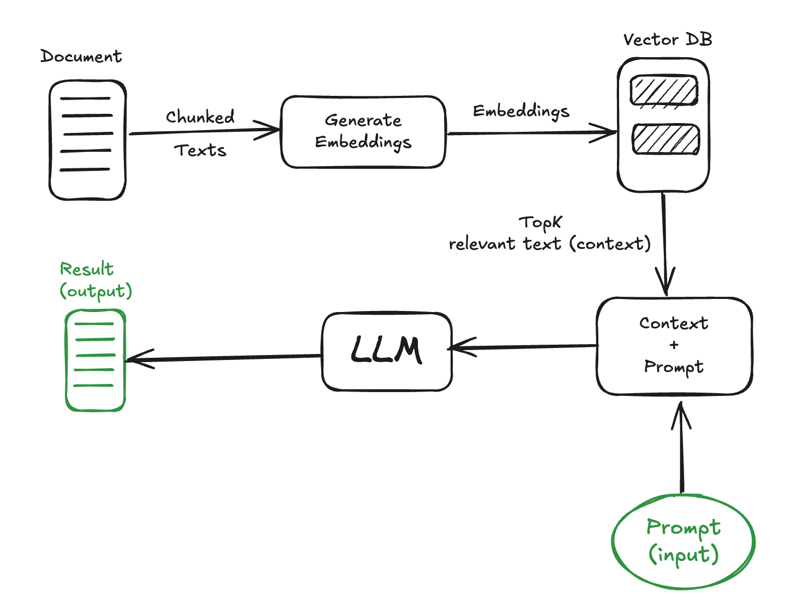
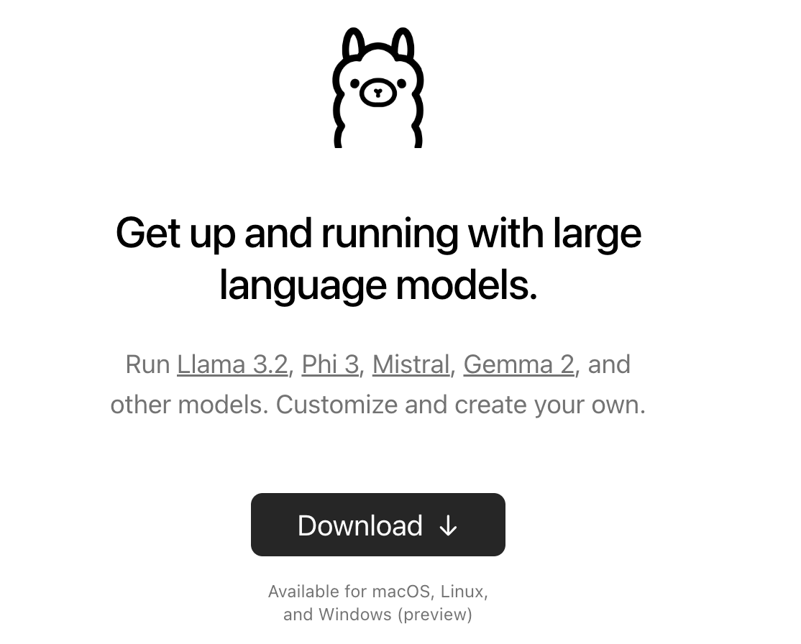
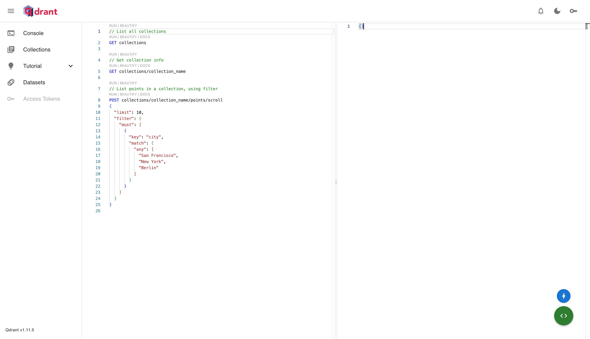
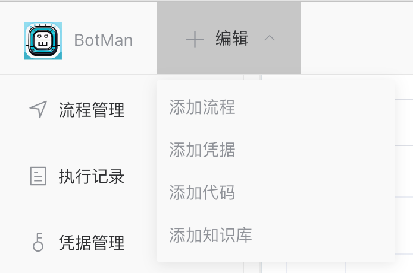
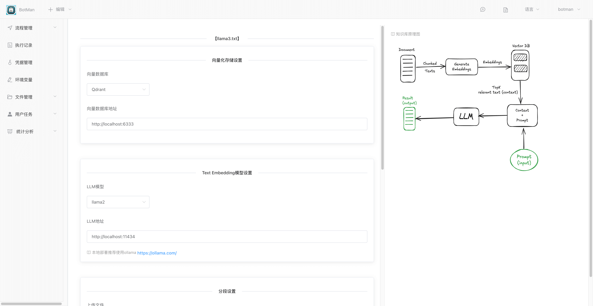
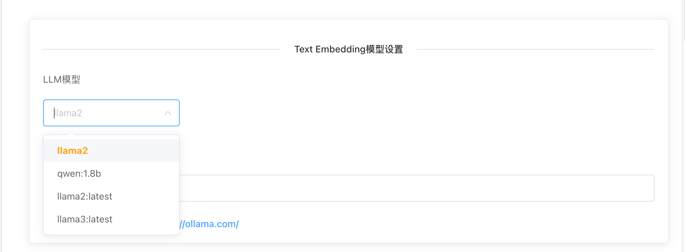
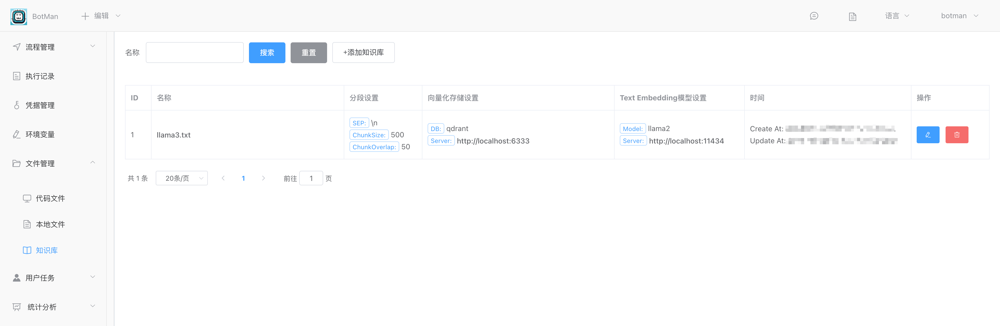
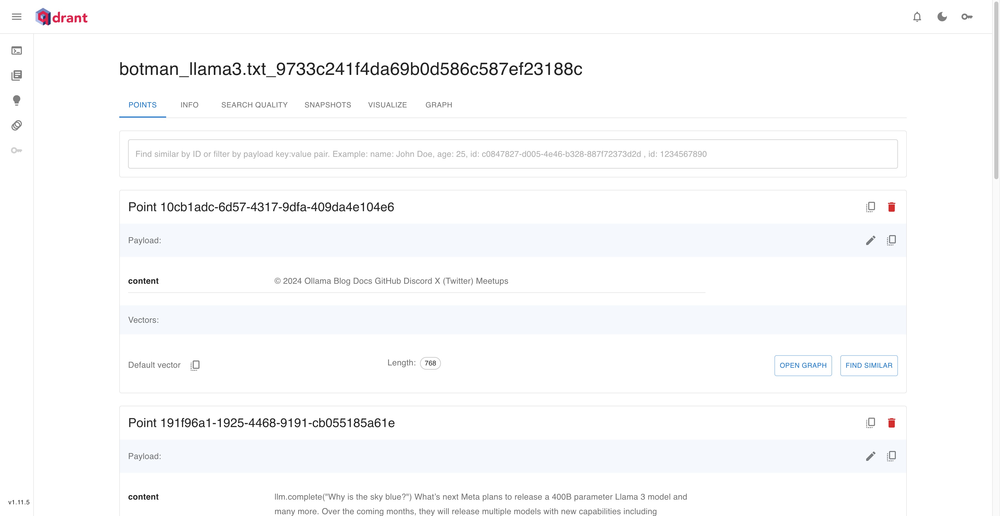
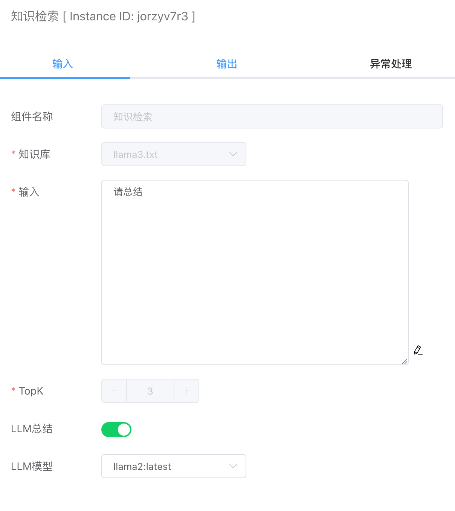

RAG（Retrieval-Augmented Generation）是一种混合方法，它结合了检索式和生成式的策略。RAG旨在提高模型在生成回答时的准确性和可靠性。它通过在大型知识库中检索相关信息，并使用生成式模型（如Transformer）来生成合适的回答。这种方法允许模型在生成回答时充分利用外部知识，从而提高了回答的质量和准确性。


如下图是RAG的完整实现流程。



- 首先是将文本存储到向量数据库中，将文档向量化
- 然后通过向量数据库的相似索引和用户输入的查询语句，找出最相似的几个关联片段
- 最后通过LLM大模型对这些返回的文档片段进行总结，输出结论


## Ollama LLM本地部署

由于我们做的是本地的RAG搭建，全程不调用商用的大模型API，所以LLM大模型用的是开源的ollama，官网地址：[https://ollama.com/](https://ollama.com/)。



ollama项目可以实现跨平台部署，支持macOS、Linux和Windows，而且部署非常简单。部署的方式可以直接登录官网查看，这里就不另外介绍。
注意：LLM对机器配置要求比较高。


## Qdrant向量数据库本地部署

本地部署qdrant数据库，推荐使用Docker，参考官网教程：https://qdrant.tech/documentation/guides/installation/#docker

```
docker pull qdrant/qdrant
docker run -p 6333:6333 qdrant/qdrant
```

部署成功之后，可以通过访问：http://localhost:6333/dashboard#/console




## 创建知识库

这里我们用`https://ollama.com/blog/llama3`的网页内容作为txt文档导入到向量数据库中。

点击【编辑】按钮会下拉显示【添加知识库】按钮。



如下是添加知识库的界面：



前面安装了ollama后，需要下载对应的模型到本地，下载成功后可以下拉显示出来：




文档越大，则向量化处理时间会比较久。处理成功后，可以在左侧的【文件管理】下【知识库】



点击名称，可以跳转到qdrant管理页面，查看向量化后的数据：



## 知识检索


### 输入



#### 知识库

会显示前面上传的文档知识库。


#### 输入

提问或命令文本。


#### TopK

返回最相关的K个关联文档的片段。


#### LLM总结

默认不启用，则值返回检索到的TopK个关联的片段内容。如果启用后，由于大模型处理比较耗时，这里执行时间会比较久一点。单纯只是返回检索内容，速度就会很快。


#### LLM模型

本地ollama可供调用的LLM大模型，用于对前面返回的TopK个片段内容进行总结分析。


### 输出

- answer。如果勾选了LLM总结，则大模型会对返回的docs文档片段进行分析总结输出结果。
- docs。返回TopK个最相关的文档片段。

例如下面是对llama3.txt文档的总结。

```json
{
    "answer": "Based on the context provided, here is a summary of the main points:\n\n* Llama 3 is an upcoming language model from Meta that will be released in multiple models with new capabilities.\n* The model will have 400B parameters, which is double the size of Llama 2.\n* The dataset used to train Llama 3 is seven times larger than Llama 2.\n* The context length of Llama 3 is 8K, which is twice the length of Llama 2.\n* Llama 3 encodes language more efficiently using a larger token vocabulary with 128K tokens.\n* The initial release of Llama 3 includes two sizes: 8B and 70B parameters.\n\nIn conclusion, Llama 3 is an improved version of the Llama 2 language model with increased capabilities, larger dataset, and more efficient encoding.",
    "docs": [
        {
            "pageContent": "© 2024 Ollama Blog Docs GitHub Discord X (Twitter) Meetups",
            "score": 201.07309
        },
        {
            "pageContent": "llm.complete(\"Why is the sky blue?\") What’s next Meta plans to release a 400B parameter Llama 3 model and many more. Over the coming months, they will release multiple models with new capabilities including multimodality, the ability to converse in multiple languages, a much longer context window, and stronger overall capabilities.",
            "score": 190.61374
        },
        {
            "pageContent": "Trained on a dataset seven times larger than Llama 2 Double the context length of 8K from Llama 2 Encodes language much more efficiently using a larger token vocabulary with 128K tokens Less than 1⁄3 of the false “refusals” when compared to Llama 2 Two sizes: 8B and 70B parameters The initial release of Llama 3 includes two sizes:",
            "score": 189.52582
        }
    ]
}
```

