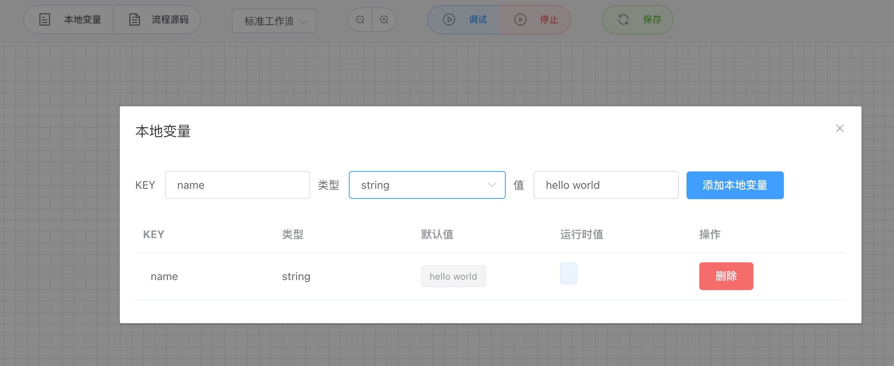
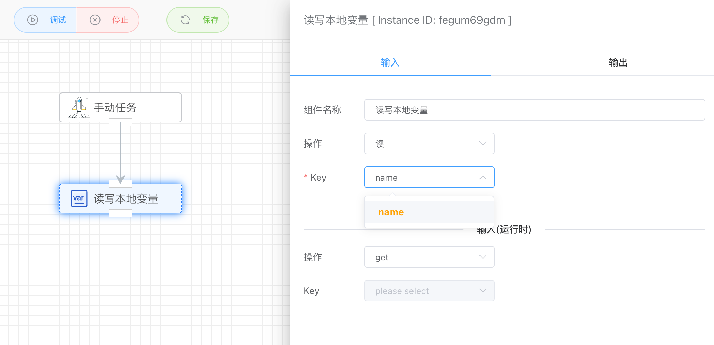

## 读写本地环境变量

每个工作流在运行时，都可以维护自己的本地变量，用于存储临时的数据。在设计工作流时，在菜单栏上有【本地变量】菜单，点击进去后可以添加该工作流可以读写的本地变量，目前支持字符串和数字两类。

每个本地变量都有默认值，以及在运行时的值。

**注意：添加本地变量前需要保存工作流先，因为本地变量需要绑定具体的工作流。**

在设置了前面的本地变量后，就可以通过【读写本地变量】的应用对变量进行读和写操作。

## 输入

### 操作

支持读和写两种操作。

### Key

读写的变量对象，这里是前面创建的本地环境变量列表。

## 输出

输出具体Key值。