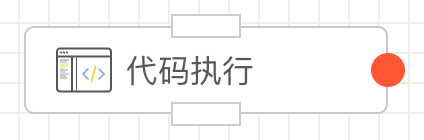
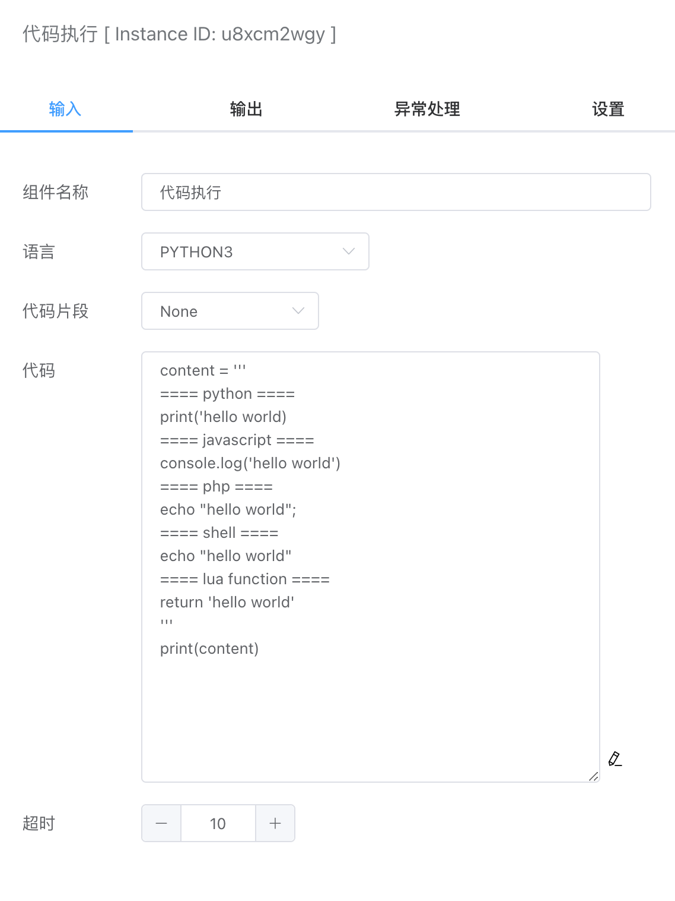
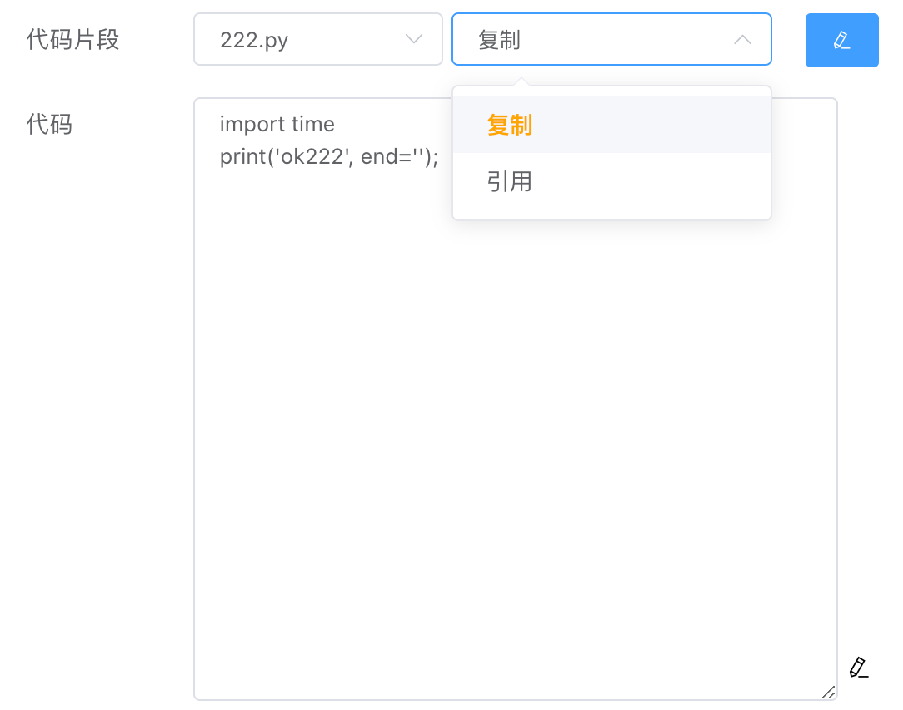
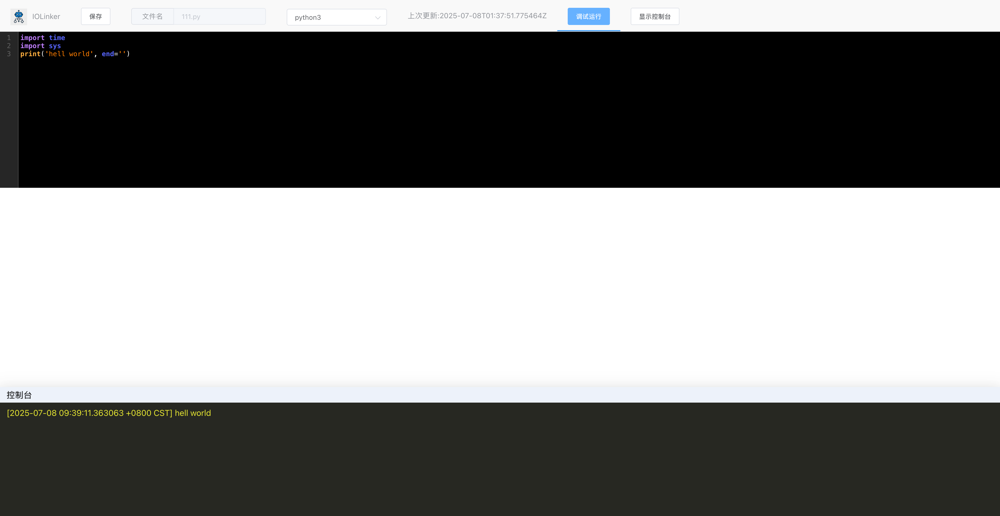

## 代码执行

支持使用本地原生虚拟机（例如本地环境的Python）或系统内置的虚拟机（不依赖本地环境）执行Python、Javascript、PHP、Golang、LUA和Shell脚本。



## 入参



### 语言

> 本地原生虚拟机

- Python3
- JavaScript
- PHP
- LUA
- SHELL

注意：本地原生虚拟机依赖当前机器环境，如果没有对应的虚拟机，则无法执行脚本。


> 内置虚拟机

- JavaScript
- LUA
- Go

注意：内置虚拟机不依赖本地环境，可以直接执行脚本。


### 代码片段

代码片段会显示【文件管理】->【代码文件】下对应编程语言列表。




针对选择的代码文件，支持两种类型的操作：

- 复制

​	该操作会复制当前选择的代码，对这部分代码的修改不影响原来引用的代码。

- 引用

  该操作是引用选择的代码，只能在【代码文件】那里打开编辑修改。


在【代码文件】的代码编辑器下，还可以一边写代码、一边调试运行：



### 代码

当前要执行的代码。


### 超时

设置脚本执行的超时时间，超过该时间，系统会强制终止，并输出错误信息：

```json
{
    "WorkflowId": 0,
    "WorkflowName": "Unknown",
    "ExecutionUid": "227174016812625920",
    "ErrorAppName": "代码执行",
    "ErrorAppInstId": "oj2ku2mtzs",
    "Error": "execute command timeout",
    "CreateAt": "xxx"
}
```


## 异常处理

默认情况下，代码执行过程中发生异常，默认采取的策略是抛出异常，然后整个工作流报错停止运行。


目前一共有以下几种策略：

- 重试
- 抛异常
- 忽略
- 捕获

### 重试

重试策略可以设置发生异常时重试的次数及其间隔。


### 抛异常

抛异常时默认策略，直接导致工作流执行异常并停止。

### 忽略

使用忽略策略，则发生异常时，系统不会抛出该错误，而是忽略它，继续往下执行。

### 捕获

可以设置响应这个异常的分支来进行处理。如下图，从右边红色的原点连接到其他节点，即可实现对异常的捕获。


## 出参

这里，终端的输出会作为该APP的输出结果，例如：

- Python3

  输出可以使用`print`：

  ```python
  print('xxx')
  ```

  注意：`print`方法默认是带换行的，会影响输出。如果想要输出不带换行，可以使用如下：

  ```python
  print('xx', end='')
  ```

- JavaScript

  输出可以使用`console.log`：

  ```
  console.log('xxx')
  ```

- PHP

  输出可以使用`echo`：

  ```php
  <?php
  echo "123";
  ```

