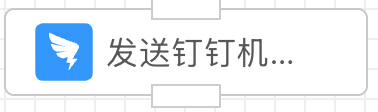
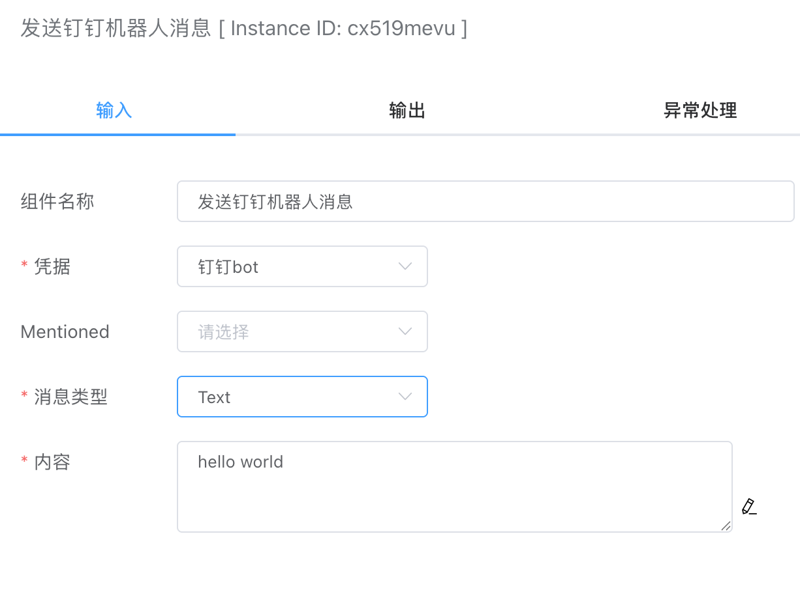
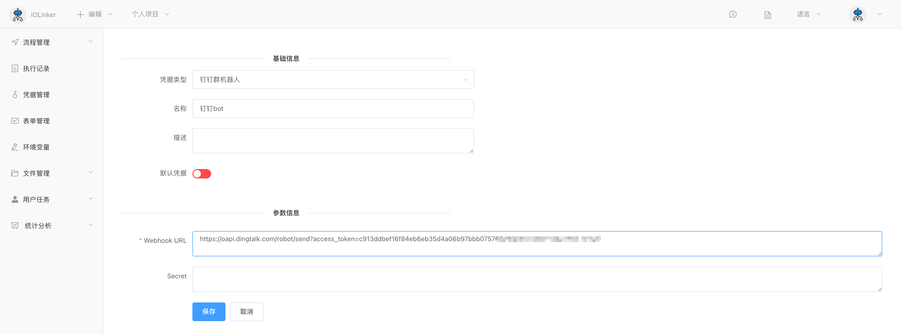

## 发送钉钉机器人消息

通过钉钉机器人发送文本、Markdown消息。




## 入参



### 凭据

需要先在【凭据管理】创建。

首先需要到钉钉客户端软件创建好自定义机器人，详细参考： [创建自定义机器人](https://open.dingtalk.com/document/orgapp/custom-bot-creation-and-installation) 




### 提醒


### 消息类型

目前支持如下几种类型：

- Text
- Markdown

选择不同的消息类型，需要输入的内容也不一样，例如Text类型就会关联文本输入框。Markdown类型支持的格式参考官方文档：https://open.dingtalk.com/document/orgapp/custom-bot-send-message-type


### 内容

消息内容


## 出参

如果发送成功，code会返回0。

```json
[
  {
    "errcode": 0,
    "errmsg": "ok",
    "messageId": ""
  }
]
```

