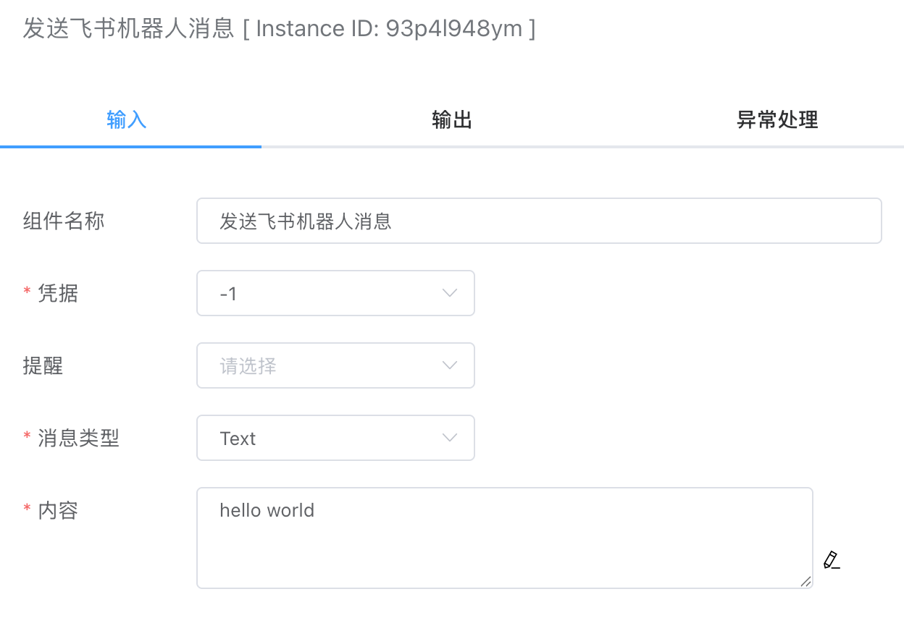
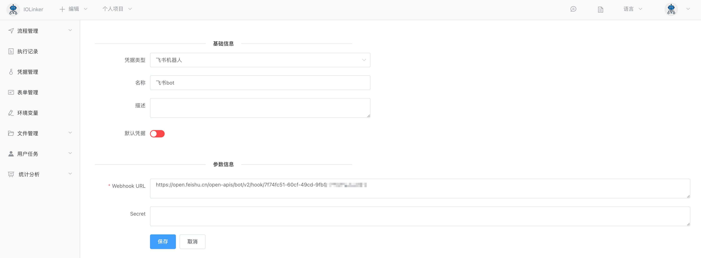
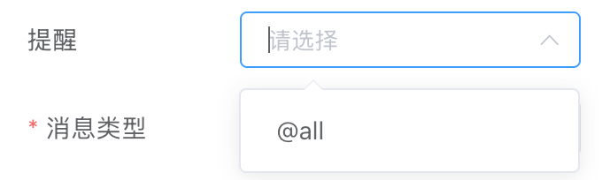

## 发送飞书机器人消息

通过飞书机器人发送文本消息。


## 入参



### 凭据

需要先在【凭据管理】创建。

首先需要到飞书客户端软件创建好自定义机器人，详细参考： [自定义机器人使用指南](https://open.feishu.cn/document/client-docs/bot-v3/add-custom-bot) 




### 提醒




### 消息类型

目前支持如下几种类型：

- Text

选择不同的消息类型，需要输入的内容也不一样，例如Text类型就会关联文本输入框。


### 内容

消息内容


## 出参

如果发送成功，code会返回0。

```json
[
  {
    "StatusCode": 0,
    "StatusMessage": "success",
    "code": 0,
    "data": {},
    "msg": "success"
  }
]
```

