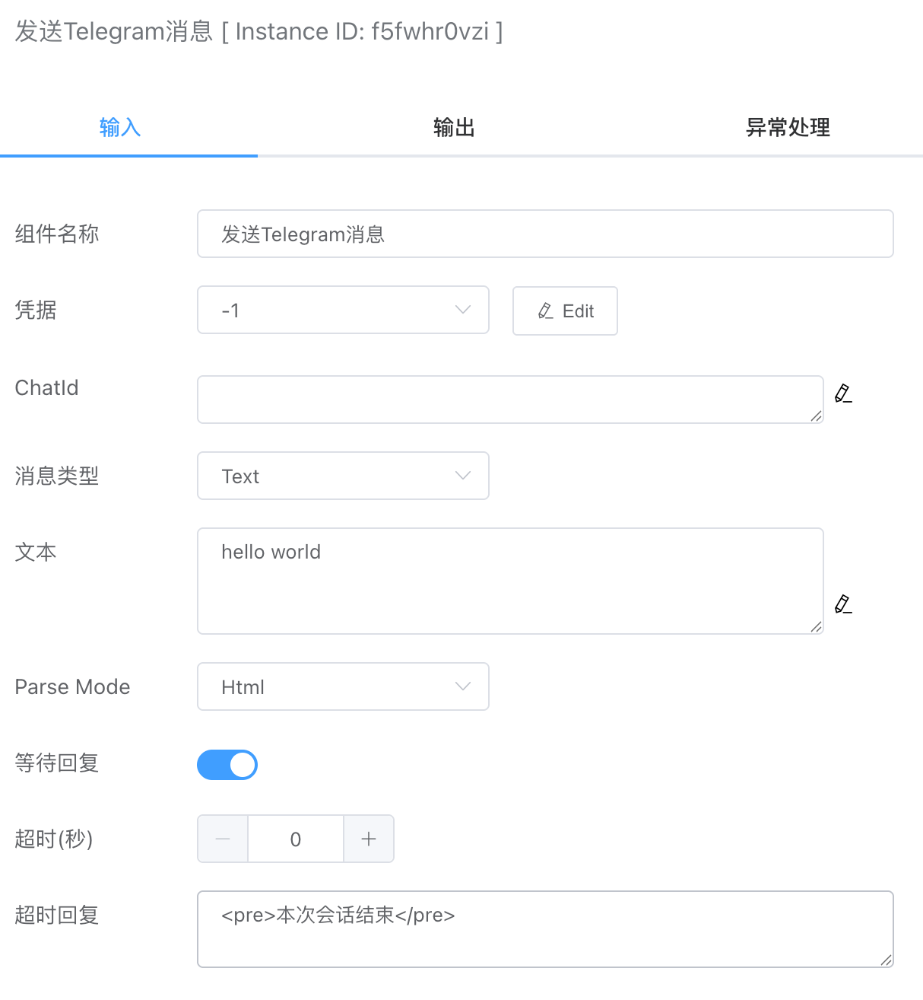
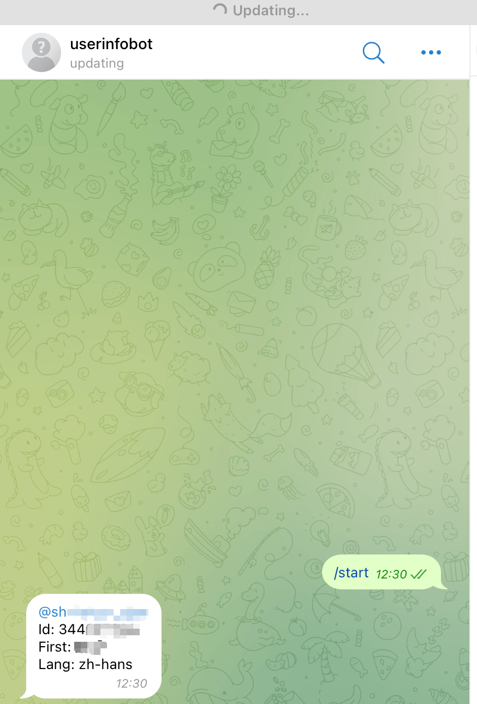
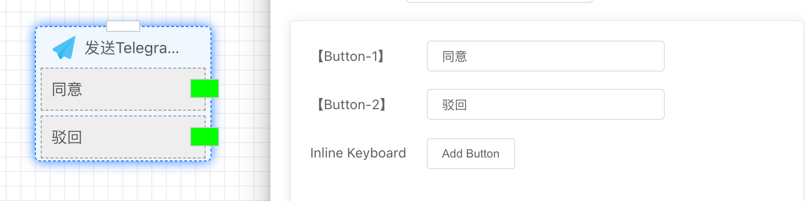

## 发送Telegram消息

支持发送文本、图片、文件、Gif等消息。


## 入参



### 凭据

需要先在【凭据管理】创建。


### ChatId

消息接收人，这里是Telegram ID。如果想查询自己的ChatID，可以通过下面的一个Telegram BOT实现。

地址：[@userinfobot](https://telegram.me/userinfobot)




### 消息类型

目前支持如下几种类型：

- Text
- Image
- File
- Video
- Audio
- Gif

选择不同的消息类型，需要输入的内容也不一样，例如Text类型就会关联文本输入框。


### Parse Mode

消息的输出格式，目前支持两种：

- Html
- Markdown


### Inline Keyboard

如果需要发送按钮类型的消息，可以在这里添加按钮。创建的按钮也可以关联后续的分支流程，如下图所示。




## 出参

如果发送成功，result会显示ok。

```json
{
    "result": "ok"
}
```

