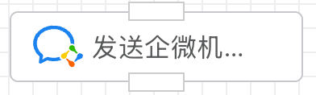
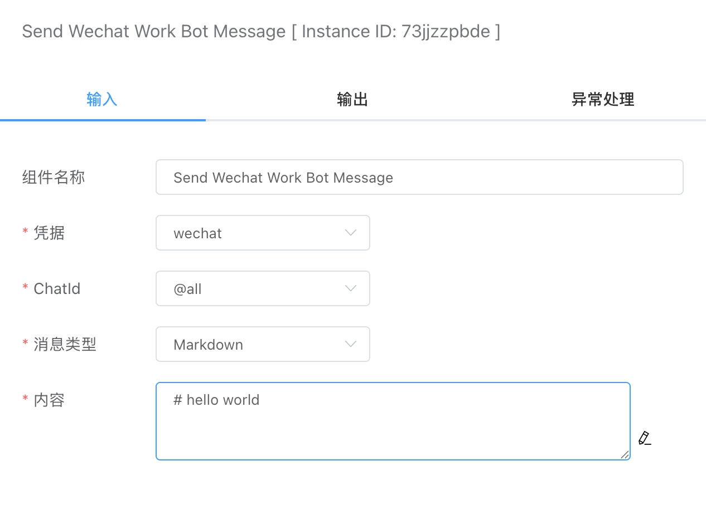
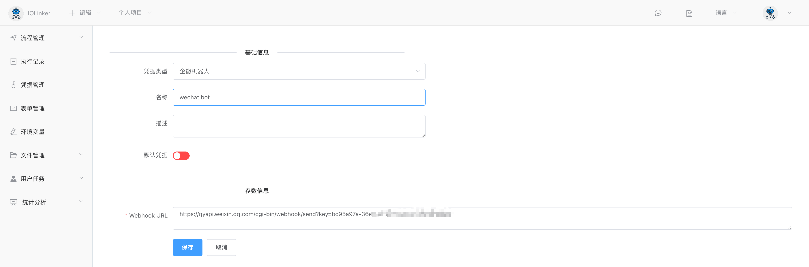

## 发送企微机器人消息

支持发送文本等消息。




## 入参



### 凭据

需要先在【凭据管理】创建。

首先需要到企微客户端软件创建好群机器人，详细参考： [创建群机器人](https://developer.work.weixin.qq.com/document/path/99110) 




### ChatId

默认给所有添加了机器人的群都发送广播消息。


### 消息类型

目前支持如下几种类型：

- Text
- Markdown

选择不同的消息类型，需要输入的内容也不一样，例如Text类型就会关联文本输入框。Markdown类型支持的格式参考官方文档：https://developer.work.weixin.qq.com/document/path/99110#markdown%E7%B1%BB%E5%9E%8B


### 内容

消息内容


## 出参

如果发送成功，code会返回0。

```json
[
  {
    "errcode": 0,
    "errmsg": "ok"
  }
]
```

