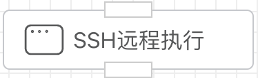

## SSH远程执行

SSH远程登录机器，并执行Shell命令。



## 入参


### 凭据

可在【凭据管理】里创建SSH凭据类型。需要配置如下几个选项：

- 主机。远程IP主机地址。
- 端口。SSH远程主机端口，默认22。
- 用户：登录账号。
- 密码：登录密码。


### 命令行

远程到目标主机上执行的shell命令。例如：

```shell
ps -ef
```


## 出参

shell命令输出的字符串。


