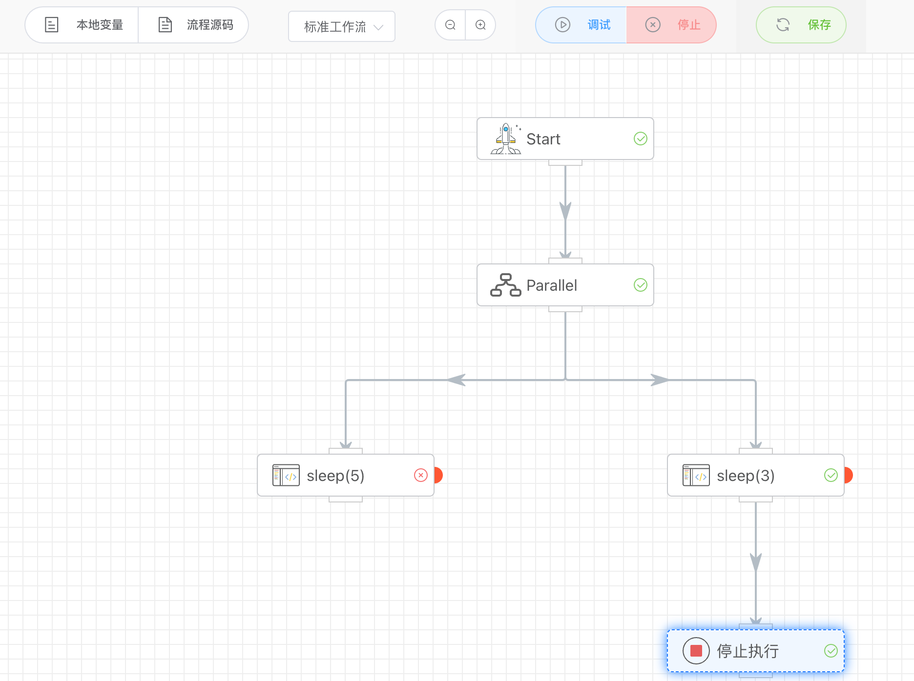

## 停止执行

强制终止运行中的工作流。执行到该节点时，如果还有部分APP运行中，也会强制结束。

<iframe 
    width="800" 
    height="600" 
    src="https://www.youtube.com/embed/jXOnAONdr94"  frameborder="0" 
    allow="accelerometer; autoplay; encrypted-media; gyroscope; picture-in-picture" 
    allowfullscreen>
</iframe>

## 入参

无

## 出参

无