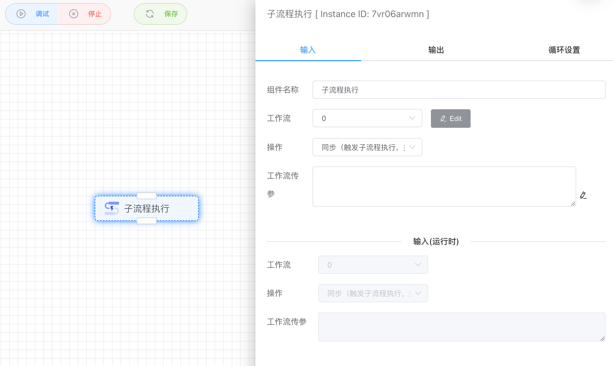
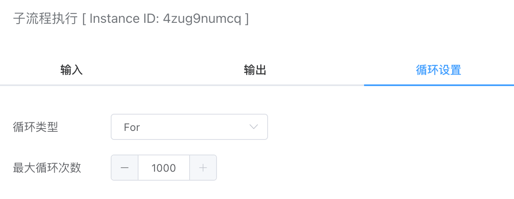

## 子工作流执行

可同步或异步方式调用子工作流执行，同步方式会等待子工作流运行结束后才继续往下执行，异步方式调用子工作流后不等待结束继续往下执行。

## 输入

### 工作流

这里可以选择同步API或异步API的工作流

### 操作

- 同步：触发子流程执行，并等待子工作流运行结束才继续往下运行
- 异步：触发子流程执行，但不等待子流程运行结束就继续往下运行

### 工作流传参

这里对于同步API和异步API类似实现Post请求JSON参数的效果。

## 循环配置

子工作流执行还支持设置子流程执行的最大循环次数。

## 输出

无

