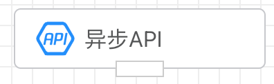
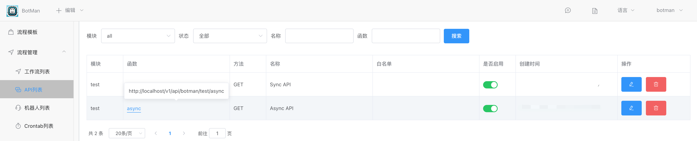
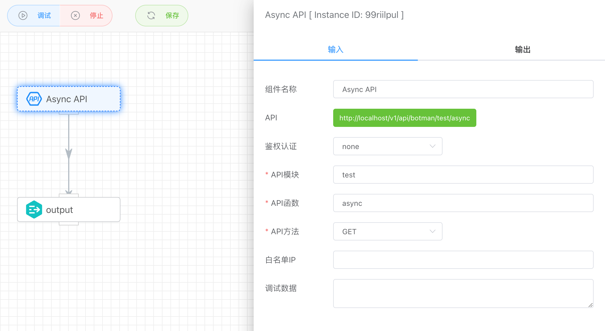
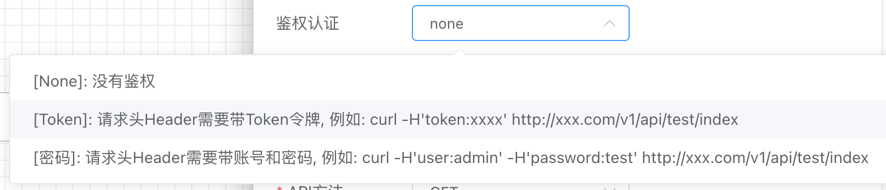

## 异步API触发器

生成一个HTTP服务的API接口，调用该接口会以异步方式触发工作流运行，不等待工作流运行结束，直接返回执行实例的ID。



创建的工作流可以在【流程管理】下的【工作流列表】或【API列表】找到。

注意：API只有启用后才能正常使用，否则会提示报错接口未启用。



## 演示


## 入参




### 鉴权认证

目前支持一下三种鉴权方式：



- 没有鉴权

  所有请求都不需要做认证鉴权。

  例如：

  ```http
  curl -d '{}' http://8.218.xxx.xx/v1/api/botman/test/async
  {"response":{"uid":"2023331691312889545691136"}}
  ```

- Token令牌鉴权

  在请求API时，需要在Header请求头带上Token令牌认证。

  例如：

  ```http
  // 错误请求方式
  curl http://8.218.xxx.xx/v1/api/botman/test/async
  {"response":{"error":{"code":"requestError.invalidParams","message":"Token is required"}}}
  ```

  ```http
  // 正确请求方式
  curl -H'token:123456' http://8.218.xxx.xx/v1/api/admin/test/async
  {"response":{"uid":"213995413340041216"}}
  ```


- 账号密码

  在请求API时，需要在Header请求头带上账号、密码认证。

  例如：

  ```http
  // 错误请求方式
  curl http://8.218.xxx.xx/v1/api/botman/test/async
  {"response":{"error":{"code":"requestError.invalidParams","message":"User/Password is required"}}}
  ```

  ```http
  // 正确请求方式
  curl -H'user:botman' -H'password:123456' http://8.218.xxx.xx/v1/api/botman/test/async
  {"response":{"uid":"213995413340041216"}}
  ```

  

### API模块

API模块主要用来对接口进行分类，例如可以按照产品分不同的模块。


### API方法

模块下的接口名称。


### API方法

目前支持GET和POST两种方法。


### 调试数据

模拟用户请求接口是传递的POST参数，方便用户调试接口。


## 输出

- uid表示执行记录ID。

```json
{
    "response": {
        "uid": "213996969363910656"
    }
}
```

