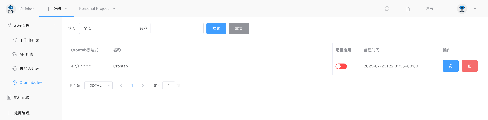

## 周期任务触发器

可设置周期性运行的工作流，支持分钟、小时、天、周和月，语法格式跟Linux系统的crontab一样。

创建的工作流可以在【流程管理】下的【工作流列表】或【Crontab列表】找到：

## 入参

### 周期表达式

五个字段分别表示如下：

 > * 分钟：0-59。注意分钟级的任务，执行的秒时刻会随机固定某个时刻，不一定是每分钟的0秒时刻，例如每分钟的第3秒等，但是运行周期是间隔一分钟。
 > * 小时：1-23
 > * 日：1-31
 > * 月：1-12
 > * 周：0-6（0表示周日）

还有一些其他特殊的字符

 > * *：表示任意时刻
 > * ,：表示多个，例如：0 2,4 * * *，表示每天的2点和4点钟整运行
 > * －：表示范围，例如：0 1-5 * * *，表示每天的1点到5点整，即1、2、3、4、5点整运行
 > * /n : 表示每隔多少时间，例如：0 */2 * * *，表示每隔2小时运行

例子：

| 表达式                   | 说明                                       |
| ------------------------ | ------------------------------------------ |
| */10 * * * *             | 每隔10分钟运行                             |
| 43 21 * * *              | 每天的21点43分运行                         |
| 15 05 * * *              | 每天的5点15分运行                          |
| 0 17 * * *               | 每天的17点运行                             |
| 0 17 * * 1               | 每周一的17点运行                           |
| 0,10 17 * * 0,2,3        | 每周日、周二、周三的17点10分运行           |
| 0-10 17 1 * *            | 每个月1号的17点0分到17点10分运行           |
| 42 4 1 * *               | 每个月1号的4点42分运行                     |
| 0 21 * * 1-6             | 每周一至周六的21点0分运行                  |
| 0,10,20,30,40,50 * * * * | 每小时的0、10、20、30、40、50分的时候运行  |
| */10 * * * *             | 每隔10分钟运行，跟上面相等                 |
| * 1 * * *                | 每天1点内每分钟运行（00分到59分）          |
| 0 1 * * *                | 每天的1点钟运行                            |
| 0 */1 * * *              | 每小时运行                                 |
| 0 * * * *                | 每小时运行                                 |
| 2 8-20/3 * * *           | 每天的8:02、11:02、14:02、17:02、20:02运行 |
| 30 5 1,15 * *            | 在每个月的1号和15号的5:30运行              |

### 是否允许多任务同时运行

如果勾选允许，则每个运行周到到达时，就会触发工作流运行，不管前面有没有运行中的工作流未跑完。

如果不勾选，则每个运行周期到达时，系统会检测前面有没有运行中的工作流未结束。如果有，则不运行，如果没有，则运行。例如创建了一个每分钟的工作流任务，有可能某个任务执行时间超过1分钟，这时候就需要用到这个逻辑来去重。

## 出参

无
