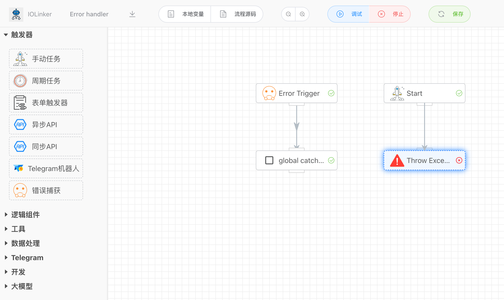
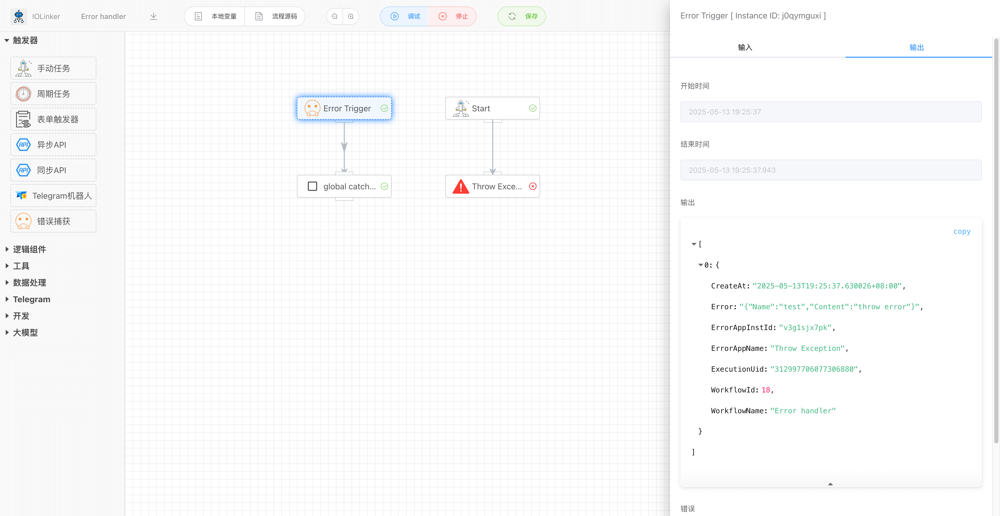

## 错误触发器


全局捕获工作流运行过程中抛出的异常或错误。如下图，错误触发器在捕获到工作流执行过程中的异常后，可以发起行的异常处理分支继续执行。这里业务可以自己对捕获到的异常信息进行响应处理，例如发送告警等。



<iframe 
    width="800" 
    height="600" 
    src="https://www.youtube.com/embed/qaK4fCVEfmg"  frameborder="0" 
    allow="accelerometer; autoplay; encrypted-media; gyroscope; picture-in-picture" 
    allowfullscreen>
</iframe>

## 入参

无


## 出参

输出信息会显示是工作流哪个节点，在什么时候，发生了什么错误。



```json
[
  {
    "CreateAt": "2025-05-13T19:25:37.630026+08:00",
    "Error": "{\"Name\":\"test\",\"Content\":\"throw error\"}",
    "ErrorAppInstId": "v3g1sjx7pk",
    "ErrorAppName": "Throw Exception",
    "ExecutionUid": "312997706077306880",
    "WorkflowId": 18,
    "WorkflowName": "Error handler"
  }
]
```

