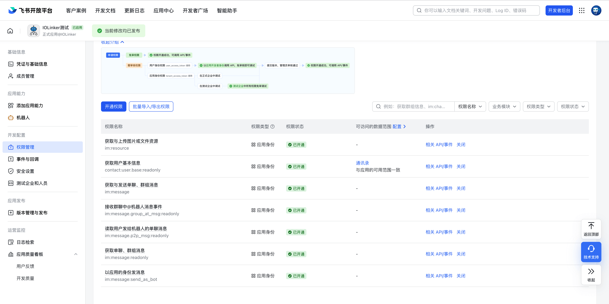
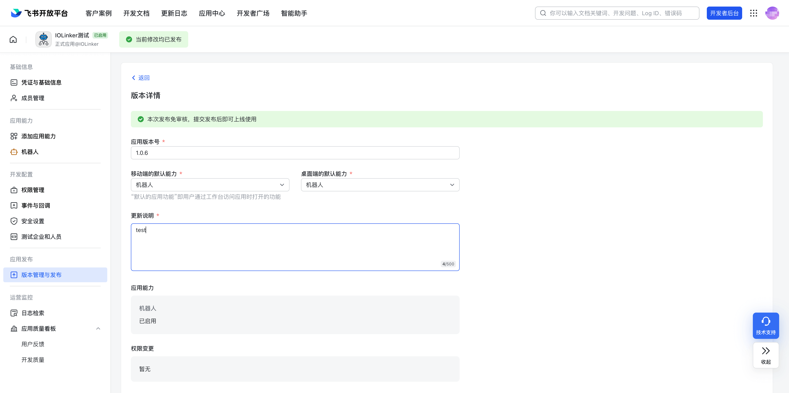
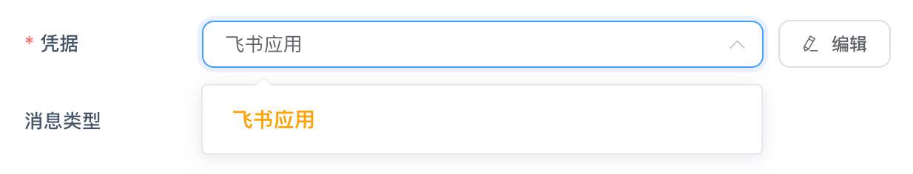
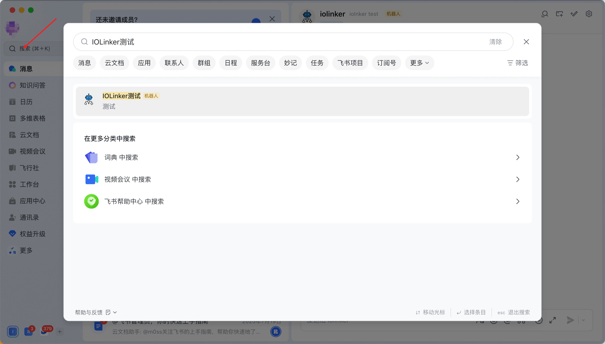
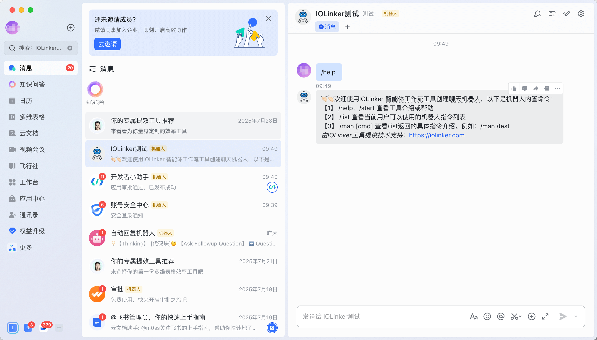

## 飞书机器人触发器

通过可视化编排的方式，实现在飞书机器人上实现指令触发功能，输入指令后会触发工作流执行，从而实现指令功能交互，即使不会Python开发也可以快速开发实现一个指令机器人。


## 入参


### 创建飞书应用凭据

#### APP ID和APP Secret

点击【凭据管理】菜单，点击【添加凭据】按钮，下拉选择【飞书应用】类型。


然后打开访问[飞书开放平台](https://open.feishu.cn/)，进入【开发者后台】点击【创建企业自建应用】。


创建后会进入应用详情页面，点击【凭证与基础信息】可以看到系统分配的APP ID和APP Secret，复制到IOLinker平台保存。


接下来，我们需要给应用添加机器人能力。

路径：【应用能力】下的【添加应用能力】，选择机器人（后续我们会通过机器人聊天窗口跟飞书应用进行交互）。


接下来配置接受事件、消息的回调配置。这种方式就不需要暴露公网地址，通过拉数据的方式获取机器人的回调消息。

同时添加【接受消息】的事件，这样，你给飞书机器人发送消息时，它才会给你拉回这个数据返回给你处理。


接下来配置权限管理，只有配置了下面的权限后，我们创建的飞书应用才能正常接受消息。




最后，点击【应用发布】下的【版本管理与发布】，设置好版本号和描述后，点击【保存】按钮即可。



前面创建好飞书应用的凭据后，就可以在凭据处下拉选择。



### 消息类型

消息类型目前仅支持文本类型。


### 触发范围


- 任意输入触发

  这种模式，IOLinker会对用户所有的文本输入进行响应，触发工作流执行。

- 命令输入触发

  这里可以设置指定方式触发，例如：`/nmap -h 127.0.0.1`。指令方式支持解析输入的参数。

  

  >  命令参数

  可以设定命令及其接受的参数，例如下面设置/test命令，如果想要传参，在机器人输入窗口输入如下。系统会自动解析输出参数值。

  当前支持如下几种参数类型：

  - Boolean
  - Integer
  - Float
  - String

  ```
  /nmap -h 1.1.1.1
  ```

  应用输出如下：

  ```json
  {
      "cmdParameters": {
          "h": "1.1.1.1"
      },
      "command": "/nmap -h 1.1.1.1",
      "from": {
          "chatType": "private",
          "id": "34412xx",
          "username": "tester"
      },
      "origin": ""
  }
  ```


### 调试数据

调试数据是模拟应用在运行时输出的结果，方便用户在设计工作流时调试。


## 出参

```json
{
    "cmdParameters": {
        "h": "1.1.1.1",
        "p": 22
    },
    "command": "/test -h 1.1.1.1 -p 22",
    "from": {
        "chatType": "private",
        "id": "34412xx",
        "username": "tester"
    },
    "origin": ""
}
```

- cmdParameters

  解析输出用户命令传参的各个参数值。

- command

  用户输入的完整命令

- from

  - chatType：private表示单聊消息、group表示群聊消息
  - id：表示发送该消息的用户Telegram ID
  - username：表示发送该消息的用户名称


## 如何打开创建的应用

打开飞书客户端，点击左侧的搜索框，输入我们的机器人名称就可以看到了，双击打开就可以进行正常的聊天交互了。




由于我们创建凭据时，启用了内置的指令，这里我们直接输入`/help`，就可以看到系统自带的指令。

注意：这里系统自带的几个指令不会触发工作流执行，只是用于管理查询指令用途。



由于我们选择的触发范围是任意输入，这里我们随便输入除了系统内置指令以外的文本，都会触发工作流执行：


点击可以查看到具体回调的消息详情：


