## 表单触发器

通过提交表单触发工作流执行。

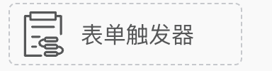

<iframe 
    width="800" 
    height="600" 
    src="https://www.youtube.com/embed/5vBL8UMtTJ0"  frameborder="0" 
    allow="accelerometer; autoplay; encrypted-media; gyroscope; picture-in-picture" 
    allowfullscreen>
</iframe>

### 操作步骤

#### 1. 创建表单

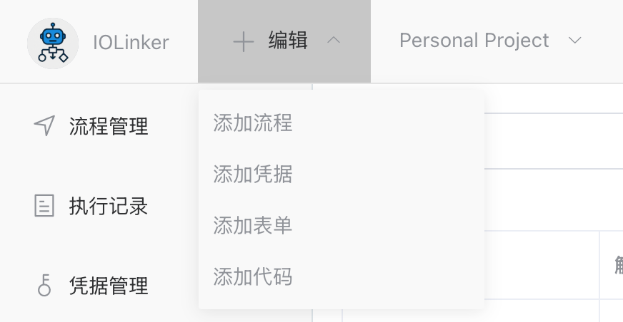

#### 2. 设计并保存表单

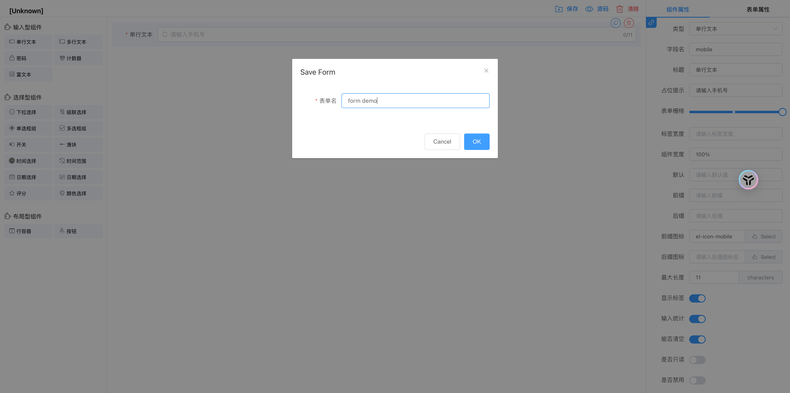

保存后的表单，可以在左侧的【表单】菜单选项查看到：

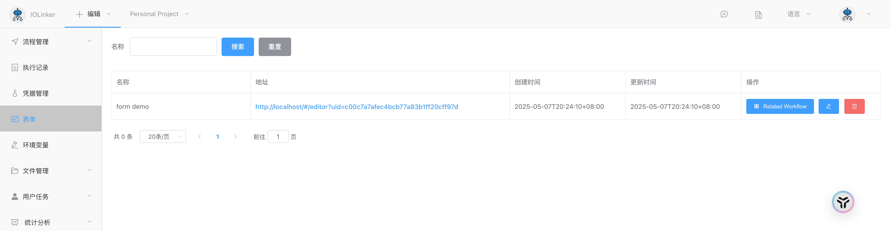

#### 3. 创建工作流并关联表单

使用【表单触发器】并在表单下拉列表中选择前面创建好的表单，这时候会看到API选项会生成一个跟表单提交地址，该地址跟工作流唯一绑定，打开该地址就可以提交表单，触发工作流执行。

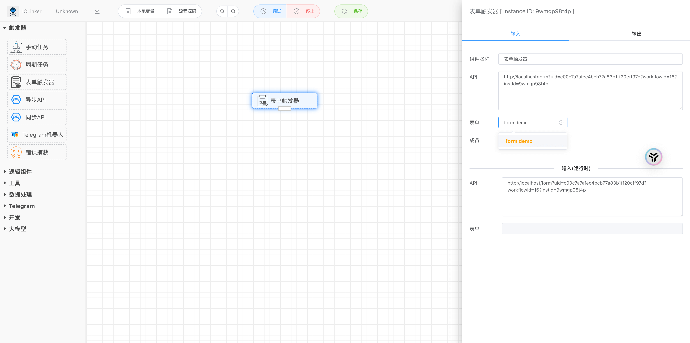

#### 4. 提交表单

在【工作流】可以看到表单提交地址，点击即进入表单提交地址。

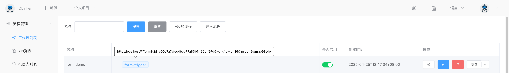

点击【Submit】提交按钮，后就可以在执行记录看到一条工作流执行记录。

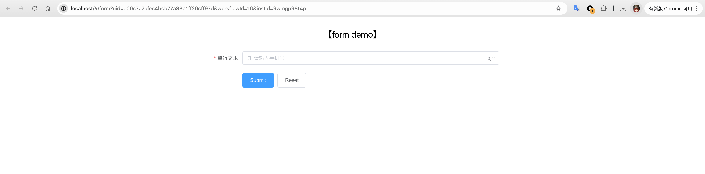

#### 5. 查看表单提交记录

表单提交记录(工作流执行记录)：

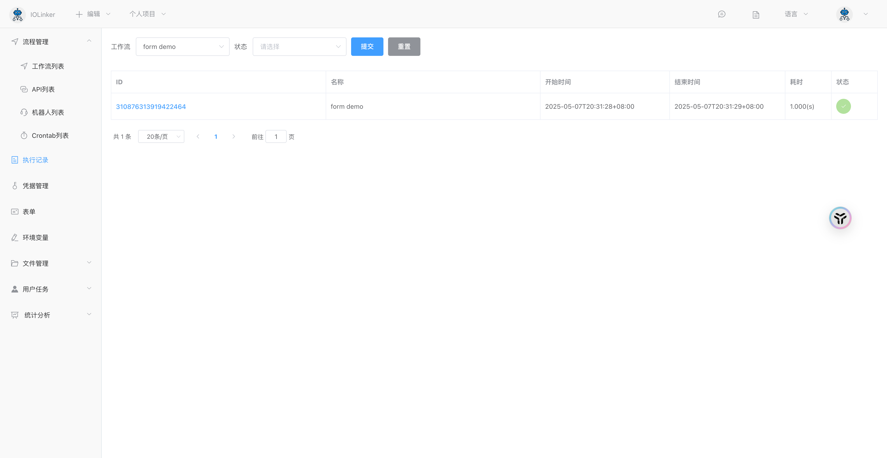

点击查看详情，可以看到表单提交的数据：

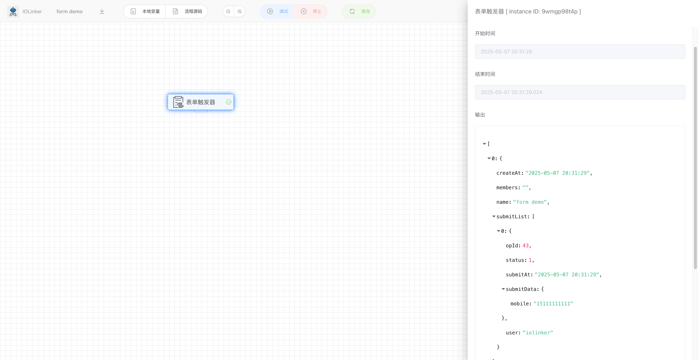


## 入参

### 表单

这里可以下拉选择要关联的表单。

### 成员

设置允许填写表单的成员，若不设置表示项目空间内的所有成员都可以提交表单。

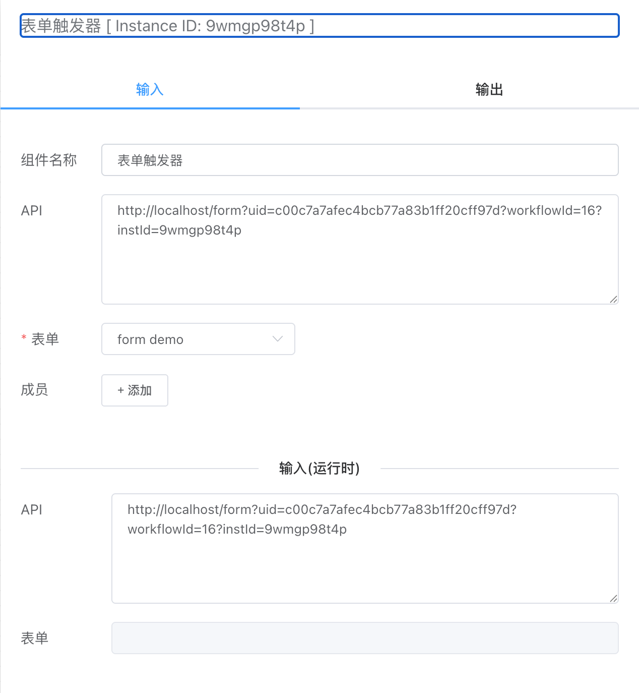

## 出参

如下，输出会显示提交人在什么时候提交的数据，以及表单各个选项的值(submitData下)。

```
[
  {
    "createAt": "2025-05-07 20:31:29",
    "members": "",
    "name": "form demo",
    "submitList": [
      {
        "opId": 43,
        "status": 1,
        "submitAt": "2025-05-07 20:31:29",
        "submitData": {
          "mobile": "15111111111"
        },
        "user": "iolinker"
      }
    ]
  }
]
```

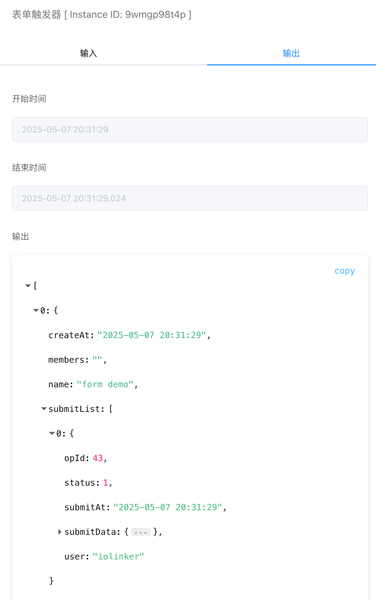