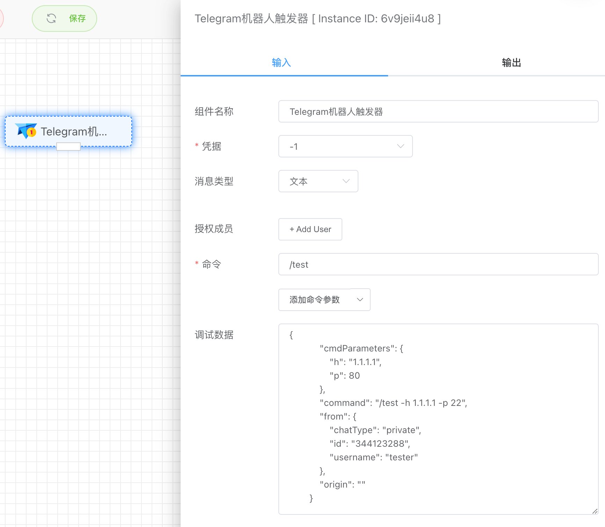
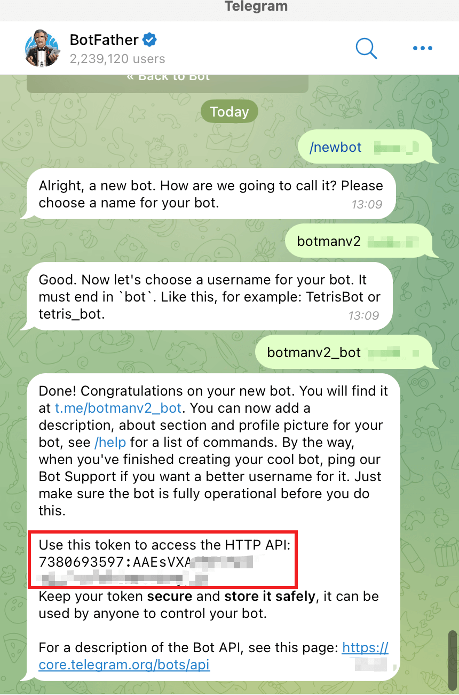
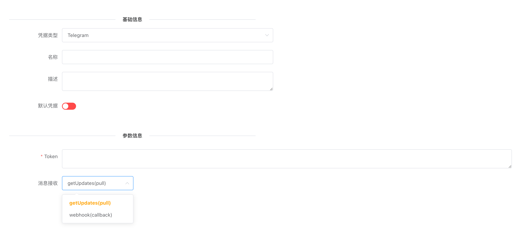
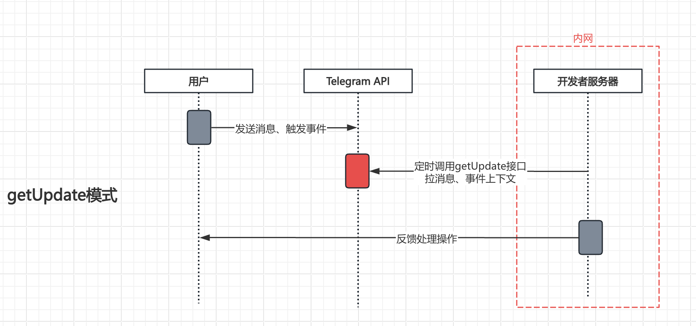
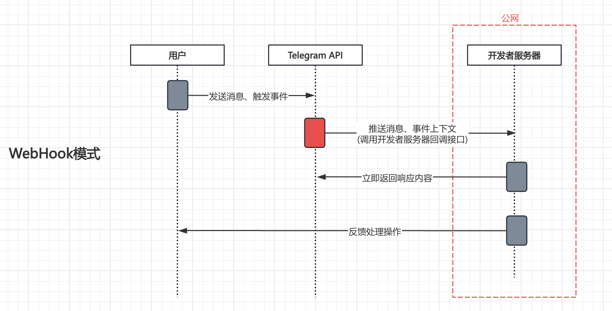
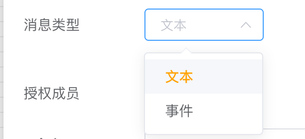
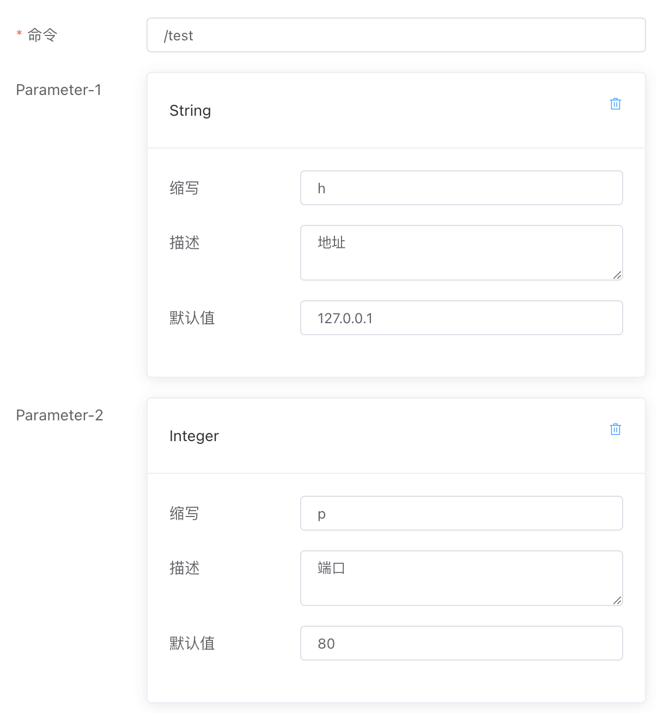

## Telegram触发器

可对在Telegram机器人上，用户发送的消息进行响应。


## 演示

<iframe width="800" height="600" src="https://www.youtube.com/embed/cGxT9cmANGw" frameborder="0" allowfullscreen></iframe>


## 入参




### 创建Telegram凭据

#### Token

这里Token是通过BotFather创建Telegram机器人时返回的一串字符串，如下图所示。



#### 消息接收

getUpdates是主动拉，适合内网且无域名环境。webhook是被动接受，适合公网且有证书域名。



- [getUpdates模式](https://core.telegram.org/bots/api#getupdates)。主动拉Telegram提供的getUpdate接口来获取发送给机器人的消息以及事件数据，这种方式不需要像WebHook那样提供域名并暴露在公网上，在内网也可以接受Telegram机器人的回调消息。。如下是该模式的流程原理：

  

- [webhook模式](https://core.telegram.org/bots/api#setwebhook)。提供一个回调地址（需要https的域名）给Telegram，Telegram会把机器人收到的消息和事件数据推送到这个回调接口，这种方式实时性会更高，但是相对低会要求用户把系统暴露到公网上，且需要提供一个带HTTPS证书的域名。如下是该模式的流程原理：

  


### 消息类型



- 文本

  文本类型消息需要设定命令及其参数，见下面。

- 事件
  - 进入聊天事件
  - 退出聊天事件
  
  事件类型消息不需要设定命令及其参数，当前支持对进入聊天和退出聊天事件进行响应。
  
  


### 授权成员

默认不设置表示所有人都有权限使用机器人命令，如需指定成员，需要设定成员的Telegram ID。


### 命令和参数

可以设定命令及其接受的参数，例如下面设置/test命令，如果想要传参，在机器人输入窗口输入如下。系统会自动解析输出参数值。

当前支持如下几种参数类型：

- Boolean
- Integer
- Float
- String

```
/test -h 1.1.1.1 -p 22
```

应用输出如下：

```json
{
    "cmdParameters": {
        "h": "1.1.1.1",
        "p": 22
    },
    "command": "/test -h 1.1.1.1 -p 22",
    "from": {
        "chatType": "private",
        "id": "34412xx",
        "username": "tester"
    },
    "origin": ""
}
```




### 调试数据

调试数据是模拟应用在运行时输出的结果，方便用户在设计工作流时调试。


## 出参

```json
{
    "cmdParameters": {
        "h": "1.1.1.1",
        "p": 22
    },
    "command": "/test -h 1.1.1.1 -p 22",
    "from": {
        "chatType": "private",
        "id": "34412xx",
        "username": "tester"
    },
    "origin": ""
}
```

- cmdParameters

  解析输出用户命令传参的各个参数值。

- command

  用户输入的完整命令

- from

  - chatType：private表示单聊消息、group表示群聊消息
  - id：表示发送该消息的用户Telegram ID
  - username：表示发送该消息的用户名称

