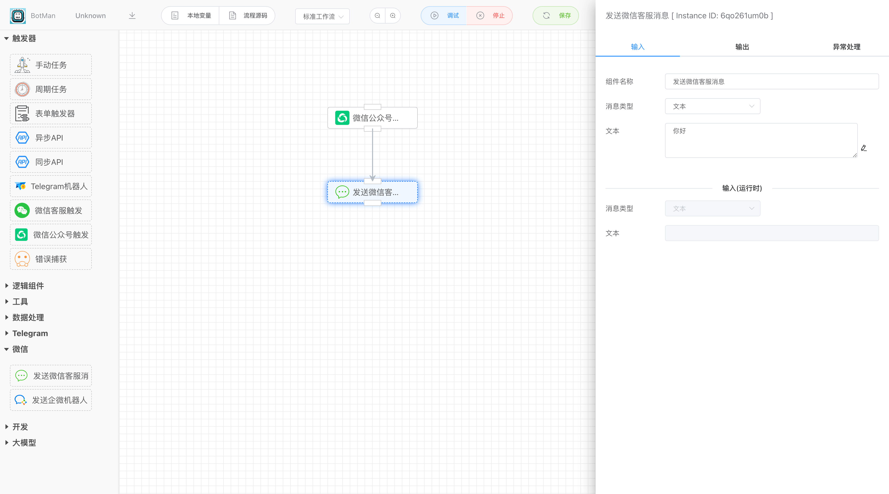
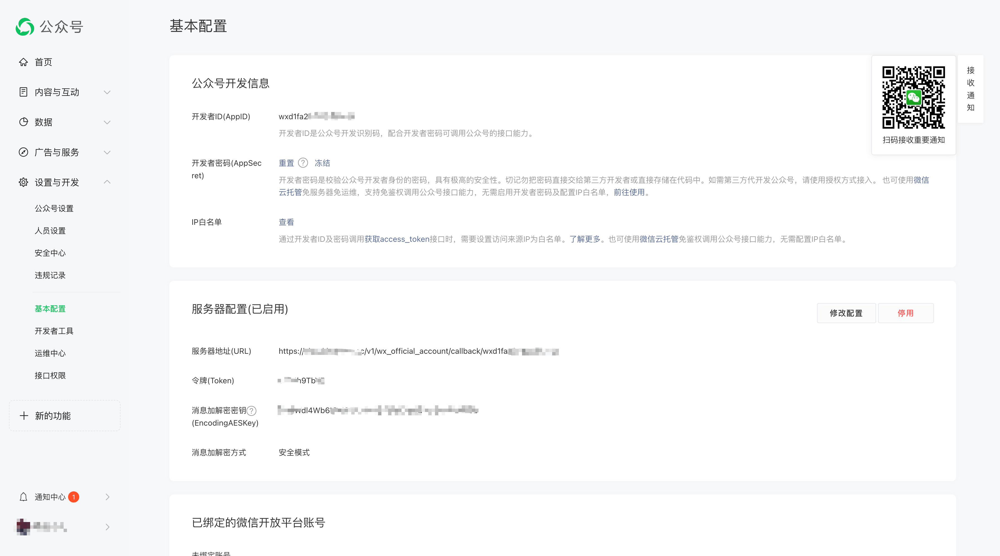
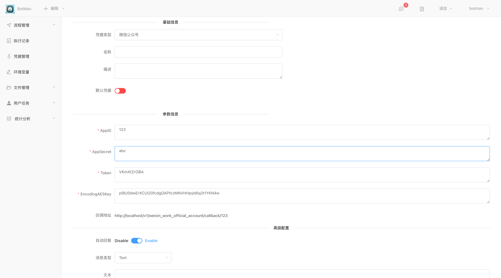
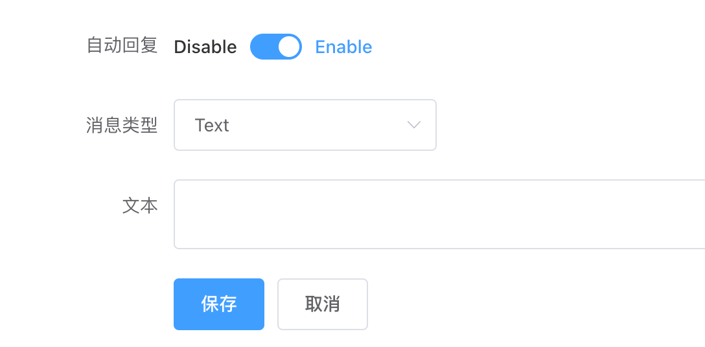
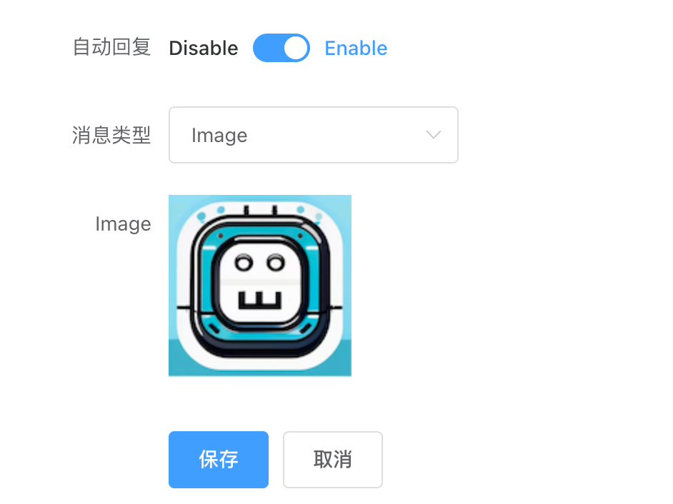
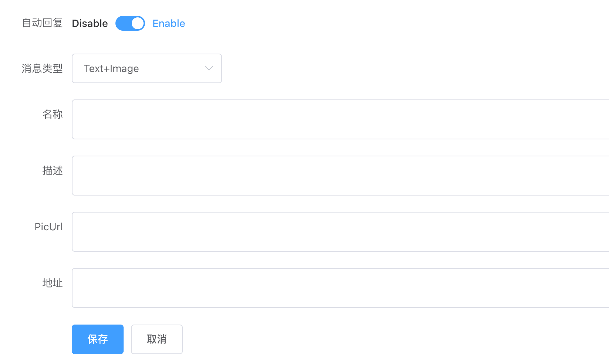
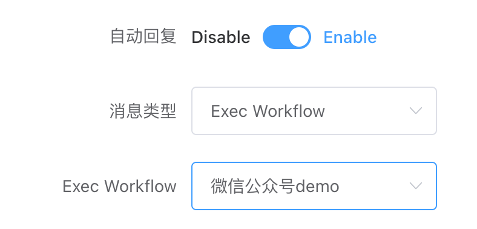

## 微信公众号触发器

### 创建微信公众号工作流

如下，创建一个简单的公众流，用于响应公众号发送的消息，这里我们只是简单的回复：你好。

### 配置微信公众号开发信息

扫码登陆[微信公众号后台](https://mp.weixin.qq.com/cgi-bin/home?t=home/index&lang=zh_CN)，进入【设置与开发】=》【基本配置】页面下，我们可以看到几个需要用到的信息：

- AppID：开发者ID。
- AppSecret：开发者密钥。

拿到上面的AppID和AppSecret后，打开Botman创建【微信公众号】类型的凭据，输入上面的AppID和AppSecret。

同时，该页面会自动生成**Token**、**EncodingAESKey**和**回调地址**，把这两个信息配置到公众号【基本配置】下的【服务器配置】选项里的**令牌(Token)、消息加解密钥(EncodingAESKey)**和**服务器地址(URL)**，消息加密方式使用**安全模式**。最后点击保存即可。

### 配置响应消息

如上图，在【高级配置】下，启用自动回复。可以设置响应的消息类型，目前支持以下几种：

- Text：文本。

  

- Image：图片。

  点击上传小于200KB的图片。

  

- Text+Image：图文。

  

- Exec Workflow：下拉可以选择启用的微信公众号触发器工作流。

  注意：由于微信官方要求，对于公众号发送的消息，必须要在5秒内响应回复，所以工作流这里在发送公众号消息之前不能做耗时的业务操作。

  

