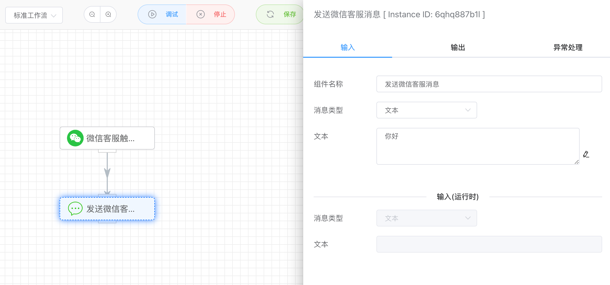

## 创建微信客服机器人

微信客服由腾讯微信团队为企业打造，用于满足企业的客服需求，帮助企业做好客户服务。企业可以在微信内、外各个场景中接入微信客服，用户可以发起咨询，企业可以进行回复。【微信客服触发器】APP可以实现客服的自动化回复，提高效率，减少人工的成本。

详细介绍参考企微官方文档：https://developer.work.weixin.qq.com/document/path/94638


### 微信客服接口关联自建的应用

这一步骤的目的是因为我们要调用创建客服账号的[接口](https://developer.work.weixin.qq.com/document/path/94638#%E5%A6%82%E4%BD%95%E5%BC%80%E5%90%AFAPI)，所以需要关联自建应用才有权限。

位置：【应用管理】=》【应用】下**基础**栏目的【微信客服】

地址：https://work.weixin.qq.com/wework_admin/frame#/app/servicer


点击【通过API管理会话消息】下的【企业内部开发】。备注：我们是自建应用的方式。


进入后，会看到如下页面，点击【前往配置】跳转到配置自建应用的页面。


点击设置，关联创建的自建应用：


### 创建默认客服账号

由于企微平台的要求，自建应用默认至少要关联一个客服账号，所以我们需要在这里创建一个默认客服账号先。


### 配置客服账号

前面关联了应用以及创建默认客服账号后，接下来，需要把应用关联到这个默认客服账号，后续就可以正常调用微信客服的API。


应用关联默认客服账号。


前面在企微上创建的客服账号，也可以在BotMan工具上查看。


## 创建微信客服工作流

如下，我们使用【微信客服触发器】APP，可以设置上传的客服头像和名称。

由于每个客服都要关联到企微应用，所以需要在凭据这里选择对应企微应用的凭据。

创建凭据的流程可以参考文章：[创建企微应用凭据](how_to_get_weixin_work_credential.md)


微信客服触发器接收到用户发送的消息或事件后，会作为APP的输出。接下来，我们可以对消息进行回复，可以使用【发送微信客服消息】APP，例如下面发送一个简单的文本回复。




创建成功后，可以在【流程管理】菜单的【机器人列表】下的【微信客服】看到我们创建的客服账号。


点击客服ID可以获取到二维码访问链接，用手机微信【扫一扫】就可以打开客服的聊天窗口。


当然，这个客服账号在企微平台上也可以看到，两边的数据是同步的。如果需要删除客服账号，需要在BotMan工具上操作，因为客服账号是通过BotMan工具创建的。


## 自动客服最终效果

如下，我们对客服随便发送一条消息，客服机器人会自动根据我们的设定进行消息回复。

这里，可以结合一些大模型的API进行更智能化的设计。


在执行记录，可以看到前面的自动回复的执行链路。我们可以通过变量表达式来引用用户输入的文本内容。


## QA

### 1、白名单IP

如果保存工作流时，提示如下的错误信息，表示需要对开发者服务器出口IP进行加白。

```shell
save error, msg:not allow to access from your ip, hint: [1726976434197xxxxx], from ip: 4.22.76.204, more info at https://open.work.weixin.qq.com/devtool/query?e=60020
```

我们需要到自建应用里，【开发者接口】下的【企业可信IP】加白该IP即可。

