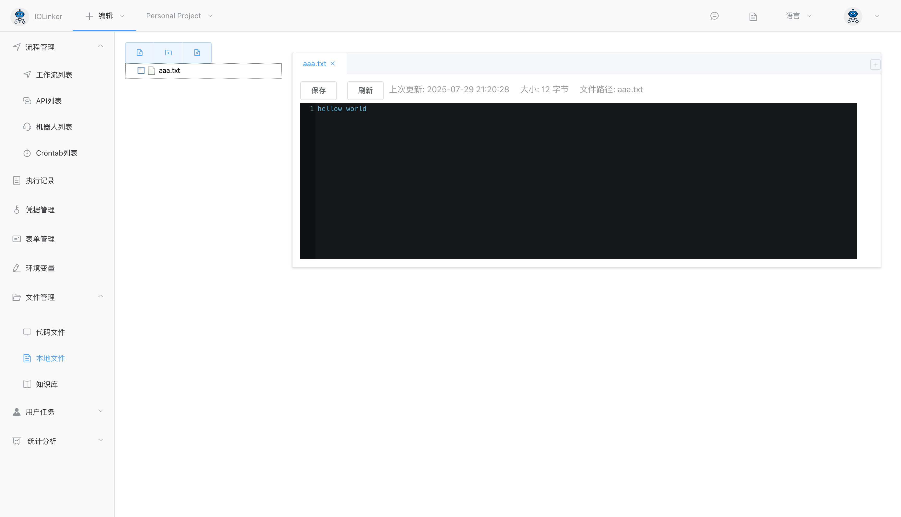

## 文件写入

可向本地文件写入文本数据，并在平台的【文件管理】下查看和维护。

写入成功的文件可以在【文件管理】下的【本地文件】查看到，并且可以在这里进行编辑和更新。

<iframe 
    width="800" 
    height="600" 
    src="https://www.youtube.com/embed/irENExYvvJM"  frameborder="0" 
    allow="accelerometer; autoplay; encrypted-media; gyroscope; picture-in-picture" 
    allowfullscreen>
</iframe>

## 入参

### 文件名

保存的文件名，例如：test.txt。

### 编码

当前支持UTF8编码格式。

### 操作

- 覆盖

  如果有同名的文件，则覆盖该文件数据，如果没有同名文件，则新建文件。

- 追加

  如果有同名的文件，则在文件末尾添加数据，如果没有同名文件，则新建文件。

- 删除文件

  删除指定的文件名。

### 添加数据

设置是否每条数据都添加换行。

### 内容

写入的文本数据内容。

## 出参

显示写入的字节个数。

